# kSpaceClean v1 详细实现方案设计

**配套文档**：[2026-07-25-kraftly-kspaceclean-design.md](./2026-07-25-kraftly-kspaceclean-design.md)
**目标**：把 v1 设计规格落地为可编码的完整技术方案
**范围**：架构模式、核心流程图、类图、时序图、状态机、数据模型图

---

## 1. 分层架构

### 1.1 总体分层
```
┌─────────────────────────────────────────────────┐
│  Presentation Layer (SwiftUI + AppKit)          │
│  - Views / ViewModels / Coordinators            │
├─────────────────────────────────────────────────┤
│  Application Layer (Use Cases)                  │
│  - ScanUseCase / CleanupUseCase                 │
│  - PermissionUseCase / HistoryUseCase           │
├─────────────────────────────────────────────────┤
│  Domain Layer (Business Logic)                  │
│  - Entities / Value Objects / Domain Services   │
├─────────────────────────────────────────────────┤
│  Infrastructure Layer                           │
│  - FileSystem / CoreML / CoreData / TCC / XPC   │
├─────────────────────────────────────────────────┤
│  Foundation Layer (kFoundation)                 │
│  - FileScanner / PrivacyShield / AppCatalog     │
│  - Capabilities / DesignSystem / CommonUtils    │
└─────────────────────────────────────────────────┘
```

**依赖方向**：上层依赖下层，**下层绝不依赖上层**。kFoundation 不引用任何 App 代码。

### 1.2 模块依赖图

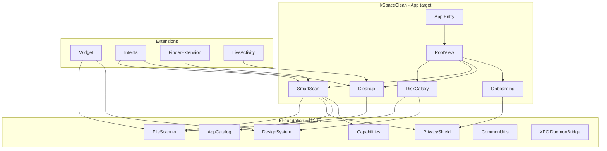
```mermaid
graph TB
    subgraph Foundation[kFoundation - 共享层]
        FS[FileScanner]
        PS[PrivacyShield]
        AC[AppCatalog]
        CAP[Capabilities]
        DS[DesignSystem]
        CU[CommonUtils]
        DB[XPC DaemonBridge]
    end

    subgraph App[kSpaceClean - App target]
        APP[App Entry]
        RC[RootView]
        DG[DiskGalaxy]
        SS[SmartScan]
        CL[Cleanup]
        OB[Onboarding]
    end

    subgraph Ext[Extensions]
        W[Widget]
        I[Intents]
        FE[FinderExtension]
        LA[LiveActivity]
    end

    APP --> RC
    RC --> DG
    RC --> SS
    RC --> CL
    RC --> OB
    DG --> FS
    DG --> DS
    SS --> FS
    SS --> PS
    SS --> AC
    SS --> CAP
    CL --> FS
    OB --> PS
    W --> FS
    W --> DS
    I --> SS
    I --> CL
    FE --> SS
    LA --> CL
```

---

## 2. 架构模式

### 2.1 MVVM + Coordinator

| 角色 | 职责 | 示例 |
|---|---|---|
| **View** | 纯 SwiftUI 声明式 UI | `GalaxyView.swift` |
| **ViewModel** | `ObservableObject` 类，承载 UI 状态与意图 | `GalaxyViewModel.swift` |
| **Coordinator** | 导航与流程编排 | `ScanCoordinator.swift` |
| **UseCase** | 跨 ViewModel 复用的业务逻辑 | `ScanUseCase.swift` |

> **关于状态管理**：本 App 部署到 macOS 13，使用 `ObservableObject` + `@Published`（Combine）。Swift 5.9 的 `@Observable` 宏需要 macOS 14+，**不直接使用**。如未来升级，可封装 `StateObserver` 协议统一抽象，本节所有 `@Observable` 描述均实际为 `ObservableObject`。

**原则**：
- View 只读 ViewModel 暴露的 `@Published` 状态
- ViewModel 不直接访问 FileSystem，统一通过 UseCase
- Coordinator 注入到 ViewModel 构造器
- ViewModel 之间不直接通信，通过 UseCase + 共享 `ObservableObject` 状态

### 2.2 Repository 模式（数据访问抽象）

```swift
protocol ScanRecordRepository {
    func save(_ record: ScanRecord) async throws
    func recent(limit: Int) async throws -> [ScanRecord]
    func delete(_ id: UUID) async throws
}
```

| 实现 | 用途 |
|---|---|
| `CoreDataScanRecordRepository` | 主实现（macOS 13+ 兼容） |
| `InMemoryScanRecordRepository` | 单元测试与 Widget 快照 |

切换实现不污染上层 UseCase。

### 2.3 Strategy 模式（AI 分类器可替换）

```swift
protocol FileClassifier {
    func classify(_ entry: FileMetadata) async -> Classification
}

struct Classification {
    let category: FileCategory
    let confidence: Double
}

enum FileCategory: String, CaseIterable {
    case image, video, document, audio, cache, dev, app, other
}
```

| 实现 | 用途 |
|---|---|
| `CoreMLFileClassifier` | 主实现（Apple Neural Engine 加速） |
| `RuleBasedFileClassifier` | 扩展名规则匹配（降级方案） |
| `HybridFileClassifier` | 组合策略（CoreML 失败时回退规则） |

### 2.4 Factory 模式（扫描器创建）

```swift
protocol ScanEngineFactory {
    func makeScanner(for scope: ScanScope) -> ScanEngine
}
```

按 `ScanScope`（全盘 / 用户目录 / 自定义路径）创建不同配置的扫描器。

### 2.5 Observer 模式

- **SwiftUI `@Observable`**：UI 状态同步
- **Combine `PassthroughSubject`**：跨模块事件流（清理完成、扫描进度）
- **NotificationCenter**：系统级事件（如电源状态变化触发自动清理）

### 2.6 Chain of Responsibility（清理管道）

清理流程拆为多个责任链节点：

```
UserConfirm → RiskAssessment → TrashMover → HistoryRecorder → NotificationEmitter
```

每个节点独立可测，新增强制约束只需新增节点。

### 2.7 Singleton（受限使用）

仅基础设施层允许：
- `PermissionCenter.shared`（TCC 状态查询）
- `AppGroupContainer.shared`（跨进程数据共享）

业务层禁止 Singleton，避免状态不可测试。

---

## 3. 设计模式汇总表

| 模式 | 应用位置 | 解决的问题 |
|---|---|---|
| **MVVM** | 全 Feature | UI 与业务逻辑分离 |
| **Coordinator** | App 导航 | 解耦视图跳转逻辑 |
| **Repository** | 数据层 | 持久化实现可替换 |
| **Strategy** | AI 分类 | 分类算法可替换 |
| **Factory** | 扫描器创建 | 不同 scope 的扫描器构造 |
| **Observer** | 状态同步 | UI 自动响应状态变化 |
| **Chain of Responsibility** | 清理管道 | 多步骤流程可扩展 |
| **Decorator** | 扫描过滤链 | 路径白名单/黑名单叠加 |
| **Adapter** | XPC / TCC 适配 | 系统 API 抽象 |
| **Singleton**（受限） | 基础设施 | 跨进程共享状态 |
| **Builder** | Widget 配置 | 多尺寸 Widget 配置构造 |
| **State Machine** | 扫描任务状态 | 显式状态转换 |

---

## 4. 核心功能流程图

### 4.1 App 启动流程

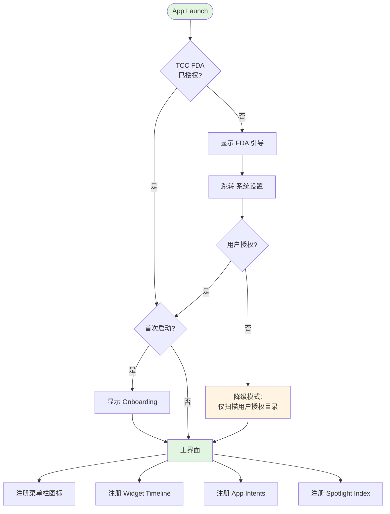
```mermaid
flowchart TD
    Start([App Launch]) --> CheckFDA{TCC FDA<br/>已授权?}
    CheckFDA -- 是 --> CheckData{首次启动?}
    CheckFDA -- 否 --> Guide[显示 FDA 引导]
    Guide --> SystemSettings[跳转 系统设置]
    SystemSettings --> UserGrant{用户授权?}
    UserGrant -- 是 --> CheckData
    UserGrant -- 否 --> DeniedState[降级模式:<br/>仅扫描用户授权目录]

    CheckData -- 是 --> Onboarding[显示 Onboarding]
    Onboarding --> MainUI
    CheckData -- 否 --> MainUI[主界面]

    MainUI --> MenuBar[注册菜单栏图标]
    MainUI --> Widgets[注册 Widget Timeline]
    MainUI --> Intents[注册 App Intents]
    MainUI --> Spotlight[注册 Spotlight Index]

    DeniedState --> MainUI

    style Start fill:#e1f5e1
    style MainUI fill:#e1f5e1
    style DeniedState fill:#fff4e1
```

### 4.2 智能扫描流程

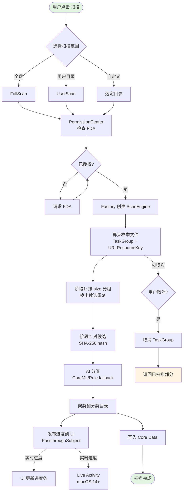
```mermaid
flowchart TD
    Start([用户点击 扫描]) --> ChooseScope{选择扫描范围}
    ChooseScope -- 全盘 --> FullScan
    ChooseScope -- 用户目录 --> UserScan
    ChooseScope -- 自定义 --> CustomScan[选定目录]

    FullScan --> CheckPerm[PermissionCenter<br/>检查 FDA]
    UserScan --> CheckPerm
    CustomScan --> CheckPerm

    CheckPerm --> Perm{已授权?}
    Perm -- 否 --> RequestPerm[请求 FDA]
    RequestPerm --> Perm

    Perm -- 是 --> BuildEngine[Factory 创建 ScanEngine]
    BuildEngine --> Enumerate[异步枚举文件<br/>TaskGroup + URLResourceKey]

    Enumerate --> Stage1[阶段1: 按 size 分组<br/>找出候选重复]
    Stage1 --> Stage2[阶段2: 对候选<br/>SHA-256 hash]
    Stage2 --> Classify[AI 分类<br/>CoreML/Rule fallback]

    Classify --> Aggregate[聚类到分类目录]
    Aggregate --> Publish[发布进度到 UI<br/>PassthroughSubject]
    Aggregate --> Store[写入 Core Data]
    Store --> Done([扫描完成])

    Publish -.实时进度.-> UI[UI 更新进度条]
    Publish -.实时进度.-> LA[Live Activity<br/>macOS 14+]

    Enumerate -.可取消.-> Cancel{用户取消?}
    Cancel -- 是 --> StopTask[取消 TaskGroup]
    StopTask --> Partial[返回已扫描部分]

    style Start fill:#e1f5e1
    style Done fill:#e1f5e1
    style Partial fill:#fff4e1
```

### 4.3 清理流程（含安全机制）

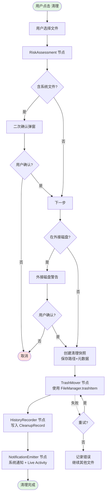
```mermaid
flowchart TD
    Start([用户点击 清理]) --> SelectFiles[用户选择文件]
    SelectFiles --> RiskCheck[RiskAssessment 节点]

    RiskCheck --> SystemFile{含系统文件?}
    SystemFile -- 是 --> Confirm1[二次确认弹窗]
    Confirm1 --> UserOK1{用户确认?}
    UserOK1 -- 否 --> Cancel1([取消])
    UserOK1 -- 是 --> Next

    SystemFile -- 否 --> Next
    Next[下一步] --> ExternalDisk{在外接磁盘?}
    ExternalDisk -- 是 --> Confirm2[外接磁盘警告]
    Confirm2 --> UserOK2{用户确认?}
    UserOK2 -- 否 --> Cancel1
    UserOK2 -- 是 --> Snapshot

    ExternalDisk -- 否 --> Snapshot[创建清理快照<br/>保存路径+元数据]

    Snapshot --> TrashMove[TrashMover 节点<br/>使用 FileManager.trashItem]

    TrashMove --> HistoryWrite[HistoryRecorder 节点<br/>写入 CleanupRecord]

    HistoryWrite --> Notify[NotificationEmitter 节点<br/>系统通知 + Live Activity]

    Notify --> Done([清理完成])

    TrashMove -.失败.-> Retry{重试?}
    Retry -- 是 --> TrashMove
    Retry -- 否 --> ErrorLog[记录错误<br/>继续其他文件]

    style Start fill:#e1f5e1
    style Done fill:#e1f5e1
    style Cancel1 fill:#ffe1e1
```

### 4.4 Widget 交互流程

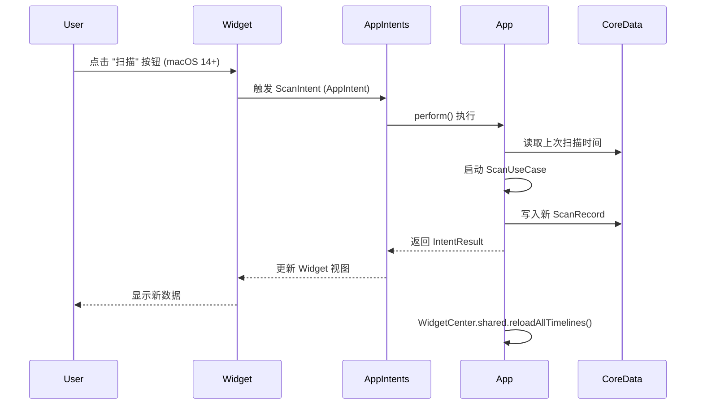
```mermaid
sequenceDiagram
    participant User
    participant Widget
    participant AppIntents
    participant App
    participant CoreData

    User->>Widget: 点击 "扫描" 按钮 (macOS 14+)
    Widget->>AppIntents: 触发 ScanIntent (AppIntent)
    AppIntents->>App: perform() 执行
    App->>CoreData: 读取上次扫描时间
    App->>App: 启动 ScanUseCase
    App->>CoreData: 写入新 ScanRecord
    App-->>AppIntents: 返回 IntentResult
    AppIntents-->>Widget: 更新 Widget 视图
    Widget-->>User: 显示新数据
    App->>App: WidgetCenter.shared.reloadAllTimelines()
```

### 4.5 首次 FDA 权限引导流程

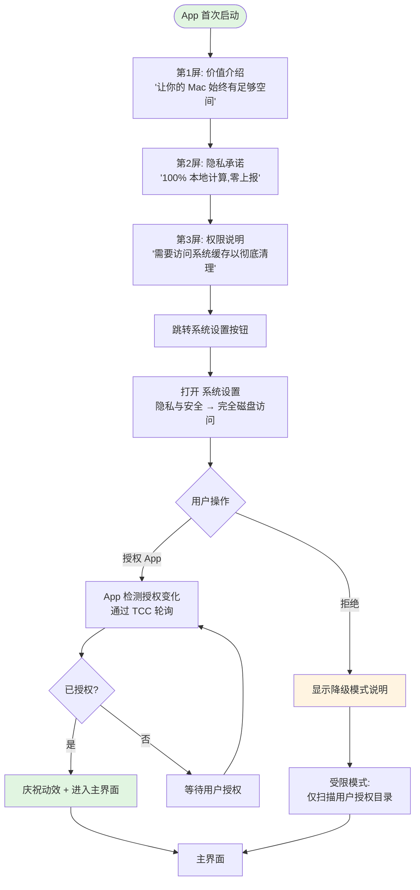
```mermaid
flowchart TD
    Start([App 首次启动]) --> ShowIntro[第1屏: 价值介绍<br/>'让你的 Mac 始终有足够空间']
    ShowIntro --> ShowPrivacy[第2屏: 隐私承诺<br/>'100% 本地计算,零上报']
    ShowPrivacy --> ShowPerm[第3屏: 权限说明<br/>'需要访问系统缓存以彻底清理']
    ShowPerm --> ActionBtn[跳转系统设置按钮]
    ActionBtn --> SystemPref[打开 系统设置<br/>隐私与安全 → 完全磁盘访问]
    SystemPref --> UserAction{用户操作}
    UserAction -- 授权 App --> Detect[App 检测授权变化<br/>通过 TCC 轮询]
    UserAction -- 拒绝 --> Denied[显示降级模式说明]

    Detect --> Authorized{已授权?}
    Authorized -- 是 --> Success[庆祝动效 + 进入主界面]
    Authorized -- 否 --> Wait[等待用户授权]
    Wait --> Detect

    Denied --> LimitedMode[受限模式:<br/>仅扫描用户授权目录]

    Success --> MainUI[主界面]
    LimitedMode --> MainUI

    style Start fill:#e1f5e1
    style Success fill:#e1f5e1
    style Denied fill:#fff4e1
```

### 4.6 Shortcuts Intent 执行流程

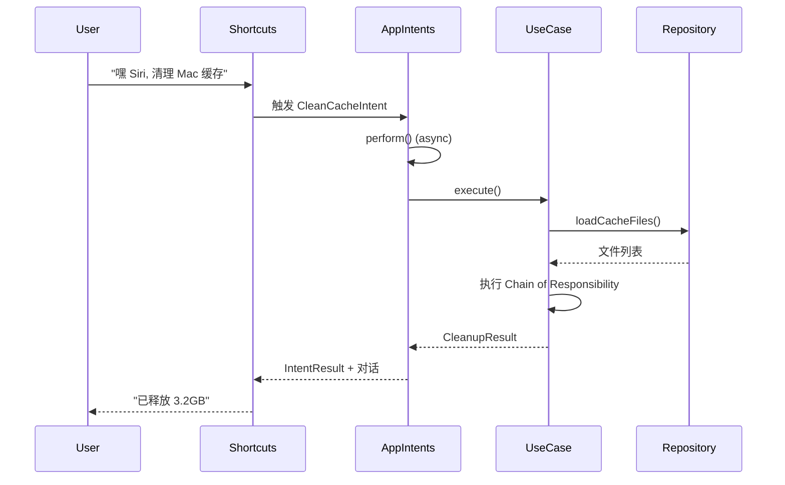
```mermaid
sequenceDiagram
    participant User
    participant Shortcuts
    participant AppIntents
    participant UseCase
    participant Repository

    User->>Shortcuts: "嘿 Siri, 清理 Mac 缓存"
    Shortcuts->>AppIntents: 触发 CleanCacheIntent
    AppIntents->>AppIntents: perform() (async)
    AppIntents->>UseCase: execute()
    UseCase->>Repository: loadCacheFiles()
    Repository-->>UseCase: 文件列表
    UseCase->>UseCase: 执行 Chain of Responsibility
    UseCase-->>AppIntents: CleanupResult
    AppIntents-->>Shortcuts: IntentResult + 对话
    Shortcuts-->>User: "已释放 3.2GB"
```

---

## 5. 类图

### 5.1 App 入口与导航

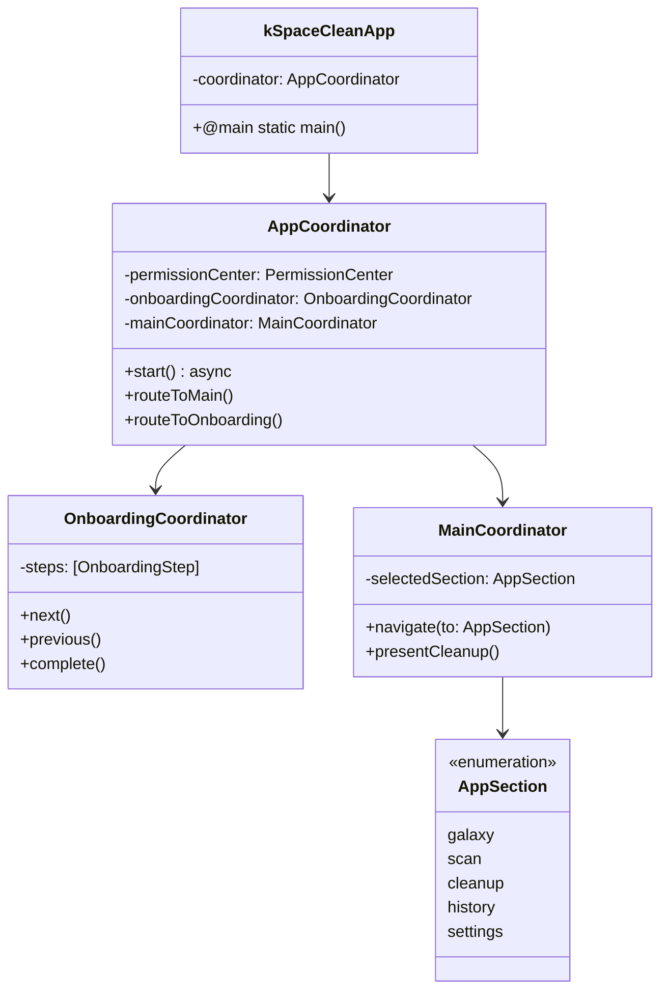
```mermaid
classDiagram
    class kSpaceCleanApp {
        +@main static main()
        -coordinator: AppCoordinator
    }
    class AppCoordinator {
        -permissionCenter: PermissionCenter
        -onboardingCoordinator: OnboardingCoordinator
        -mainCoordinator: MainCoordinator
        +start() async
        +routeToMain()
        +routeToOnboarding()
    }
    class OnboardingCoordinator {
        -steps: [OnboardingStep]
        +next()
        +previous()
        +complete()
    }
    class MainCoordinator {
        -selectedSection: AppSection
        +navigate(to: AppSection)
        +presentCleanup()
    }
    class AppSection {
        <<enumeration>>
        galaxy
        scan
        cleanup
        history
        settings
    }

    kSpaceCleanApp --> AppCoordinator
    AppCoordinator --> OnboardingCoordinator
    AppCoordinator --> MainCoordinator
    MainCoordinator --> AppSection
```

### 5.2 SmartScan Feature

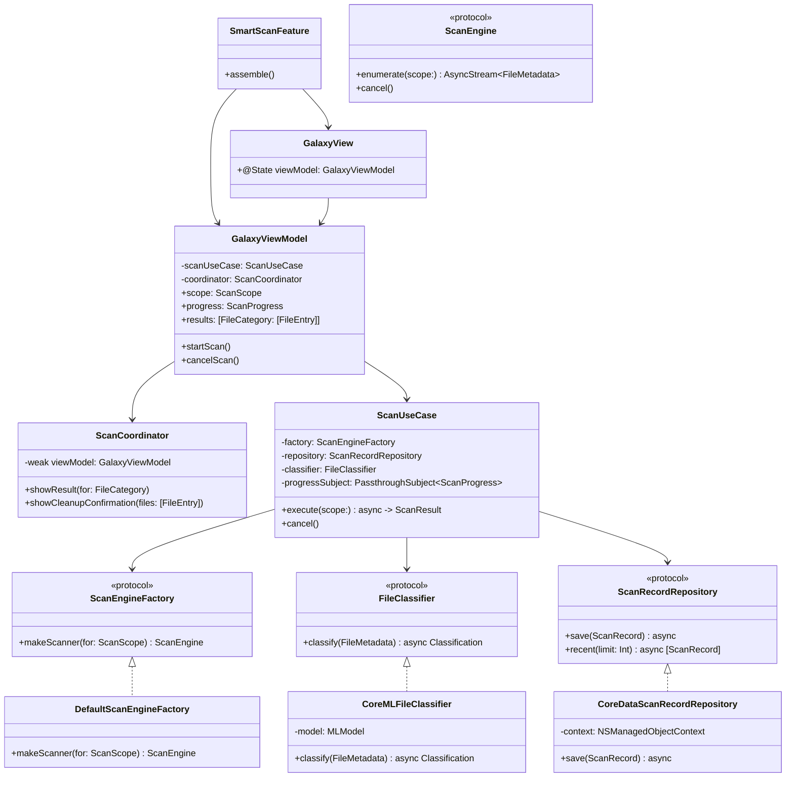
```mermaid
classDiagram
    class SmartScanFeature {
        +assemble()
    }
    class GalaxyView {
        +@State viewModel: GalaxyViewModel
    }
    class GalaxyViewModel {
        -scanUseCase: ScanUseCase
        -coordinator: ScanCoordinator
        +scope: ScanScope
        +progress: ScanProgress
        +results: [FileCategory: [FileEntry]]
        +startScan()
        +cancelScan()
    }
    class ScanCoordinator {
        -weak viewModel: GalaxyViewModel
        +showResult(for: FileCategory)
        +showCleanupConfirmation(files: [FileEntry])
    }
    class ScanUseCase {
        -factory: ScanEngineFactory
        -repository: ScanRecordRepository
        -classifier: FileClassifier
        -progressSubject: PassthroughSubject~ScanProgress~
        +execute(scope:) async -> ScanResult
        +cancel()
    }
    class ScanEngineFactory {
        <<protocol>>
        +makeScanner(for: ScanScope) ScanEngine
    }
    class DefaultScanEngineFactory {
        +makeScanner(for: ScanScope) ScanEngine
    }
    class ScanEngine {
        <<protocol>>
        +enumerate(scope:) AsyncStream~FileMetadata~
        +cancel()
    }
    class FileClassifier {
        <<protocol>>
        +classify(FileMetadata) async Classification
    }
    class CoreMLFileClassifier {
        -model: MLModel
        +classify(FileMetadata) async Classification
    }
    class ScanRecordRepository {
        <<protocol>>
        +save(ScanRecord) async
        +recent(limit: Int) async [ScanRecord]
    }
    class CoreDataScanRecordRepository {
        -context: NSManagedObjectContext
        +save(ScanRecord) async
    }

    SmartScanFeature --> GalaxyView
    SmartScanFeature --> GalaxyViewModel
    GalaxyView --> GalaxyViewModel
    GalaxyViewModel --> ScanUseCase
    GalaxyViewModel --> ScanCoordinator
    ScanUseCase --> ScanEngineFactory
    ScanUseCase --> FileClassifier
    ScanUseCase --> ScanRecordRepository
    ScanEngineFactory <|.. DefaultScanEngineFactory
    FileClassifier <|.. CoreMLFileClassifier
    ScanRecordRepository <|.. CoreDataScanRecordRepository
```

### 5.3 Cleanup Feature（含责任链）

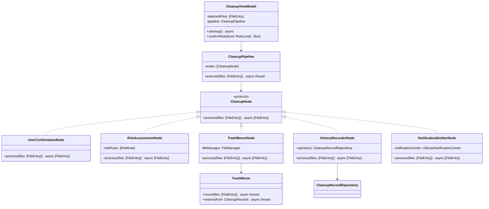
```mermaid
classDiagram
    class CleanupViewModel {
        -selectedFiles: [FileEntry]
        -pipeline: CleanupPipeline
        +cleanup() async
        +confirmRisk(level: RiskLevel) Bool
    }
    class CleanupPipeline {
        -nodes: [CleanupNode]
        +execute(files: [FileEntry]) async Result
    }
    class CleanupNode {
        <<protocol>>
        +process(files: [FileEntry]) async [FileEntry]
    }
    class UserConfirmationNode {
        +process(files: [FileEntry]) async [FileEntry]
    }
    class RiskAssessmentNode {
        -riskRules: [RiskRule]
        +process(files: [FileEntry]) async [FileEntry]
    }
    class TrashMoverNode {
        -fileManager: FileManager
        +process(files: [FileEntry]) async [FileEntry]
    }
    class HistoryRecorderNode {
        -repository: CleanupRecordRepository
        +process(files: [FileEntry]) async [FileEntry]
    }
    class NotificationEmitterNode {
        -notificationCenter: UNUserNotificationCenter
        +process(files: [FileEntry]) async [FileEntry]
    }
    class TrashMover {
        +move(files: [FileEntry]) async throws
        +restore(from: CleanupRecord) async throws
    }

    CleanupViewModel --> CleanupPipeline
    CleanupPipeline --> CleanupNode
    CleanupNode <|.. UserConfirmationNode
    CleanupNode <|.. RiskAssessmentNode
    CleanupNode <|.. TrashMoverNode
    CleanupNode <|.. HistoryRecorderNode
    CleanupNode <|.. NotificationEmitterNode
    TrashMoverNode --> TrashMover
    HistoryRecorderNode --> CleanupRecordRepository
```

### 5.4 DiskGalaxy Feature（3D 渲染）

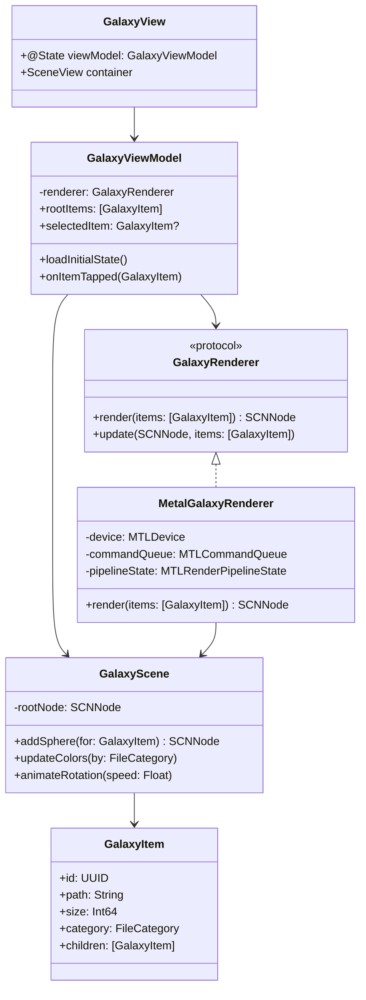
```mermaid
classDiagram
    class GalaxyView {
        +@State viewModel: GalaxyViewModel
        +SceneView container
    }
    class GalaxyViewModel {
        -renderer: GalaxyRenderer
        +rootItems: [GalaxyItem]
        +selectedItem: GalaxyItem?
        +loadInitialState()
        +onItemTapped(GalaxyItem)
    }
    class GalaxyRenderer {
        <<protocol>>
        +render(items: [GalaxyItem]) SCNNode
        +update(SCNNode, items: [GalaxyItem])
    }
    class MetalGalaxyRenderer {
        -device: MTLDevice
        -commandQueue: MTLCommandQueue
        -pipelineState: MTLRenderPipelineState
        +render(items: [GalaxyItem]) SCNNode
    }
    class GalaxyScene {
        -rootNode: SCNNode
        +addSphere(for: GalaxyItem) SCNNode
        +updateColors(by: FileCategory)
        +animateRotation(speed: Float)
    }
    class GalaxyItem {
        +id: UUID
        +path: String
        +size: Int64
        +category: FileCategory
        +children: [GalaxyItem]
    }

    GalaxyView --> GalaxyViewModel
    GalaxyViewModel --> GalaxyRenderer
    GalaxyViewModel --> GalaxyScene
    GalaxyRenderer <|.. MetalGalaxyRenderer
    MetalGalaxyRenderer --> GalaxyScene
    GalaxyScene --> GalaxyItem
```

### 5.5 Permission Layer

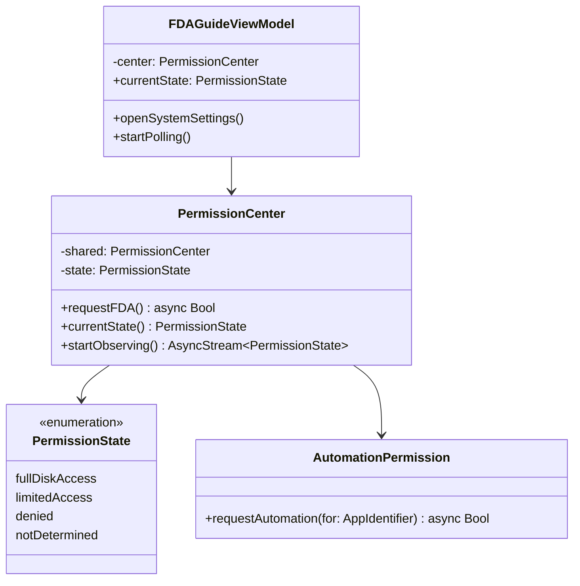
```mermaid
classDiagram
    class PermissionCenter {
        -shared: PermissionCenter
        -state: PermissionState
        +requestFDA() async Bool
        +currentState() PermissionState
        +startObserving() AsyncStream~PermissionState~
    }
    class PermissionState {
        <<enumeration>>
        fullDiskAccess
        limitedAccess
        denied
        notDetermined
    }
    class FDAGuideViewModel {
        -center: PermissionCenter
        +currentState: PermissionState
        +openSystemSettings()
        +startPolling()
    }
    class AutomationPermission {
        +requestAutomation(for: AppIdentifier) async Bool
    }

    PermissionCenter --> PermissionState
    FDAGuideViewModel --> PermissionCenter
    PermissionCenter --> AutomationPermission
```

---

## 6. 数据模型图

### 6.1 Core Data ER 图

```mermaid
erDiagram
    SCAN_RECORD ||--o{ FILE_ENTRY : contains
    CLEANUP_RECORD ||--o{ FILE_ENTRY : references
    SCAN_RECORD ||--o{ CLEANUP_RECORD : produces

    SCAN_RECORD {
        UUID id PK
        Date startedAt
        Date finishedAt
        Int64 totalBytes
        Int64 freedBytes
        String category
    }

    FILE_ENTRY {
        UUID id PK
        String path
        Int64 size
        String category
        Double confidence
        UUID scanRecordId FK
    }

    CLEANUP_RECORD {
        UUID id PK
        Date cleanedAt
        Int64 totalBytes
        Boolean isRestored
        String originalPaths JSON
    }
```

### 6.2 值对象（Value Objects）

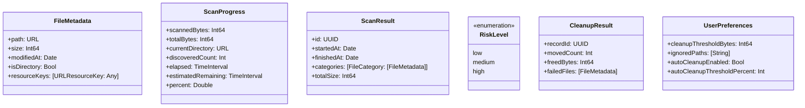
```mermaid
classDiagram
    class FileMetadata {
        +path: URL
        +size: Int64
        +modifiedAt: Date
        +isDirectory: Bool
        +resourceKeys: [URLResourceKey: Any]
    }
    class ScanProgress {
        +scannedBytes: Int64
        +totalBytes: Int64
        +currentDirectory: URL
        +discoveredCount: Int
        +elapsed: TimeInterval
        +estimatedRemaining: TimeInterval
        +percent: Double
    }
    class ScanResult {
        +id: UUID
        +startedAt: Date
        +finishedAt: Date
        +categories: [FileCategory: [FileMetadata]]
        +totalSize: Int64
    }
    class RiskLevel {
        <<enumeration>>
        low
        medium
        high
    }
    class CleanupResult {
        +recordId: UUID
        +movedCount: Int
        +freedBytes: Int64
        +failedFiles: [FileMetadata]
    }
    class UserPreferences {
        +cleanupThresholdBytes: Int64
        +ignoredPaths: [String]
        +autoCleanupEnabled: Bool
        +autoCleanupThresholdPercent: Int
    }
```

### 6.3 Widget 快照数据模型

```swift
struct WidgetStorageSummary: Codable {
    let lastUpdated: Date
    let usedBytes: Int64
    let totalBytes: Int64
    let freedLastWeek: Int64
    let topCategory: FileCategory?
}
```

存储位置：`App Group Container/widget-snapshot.json`

---

## 7. 状态机

### 7.1 扫描任务状态机

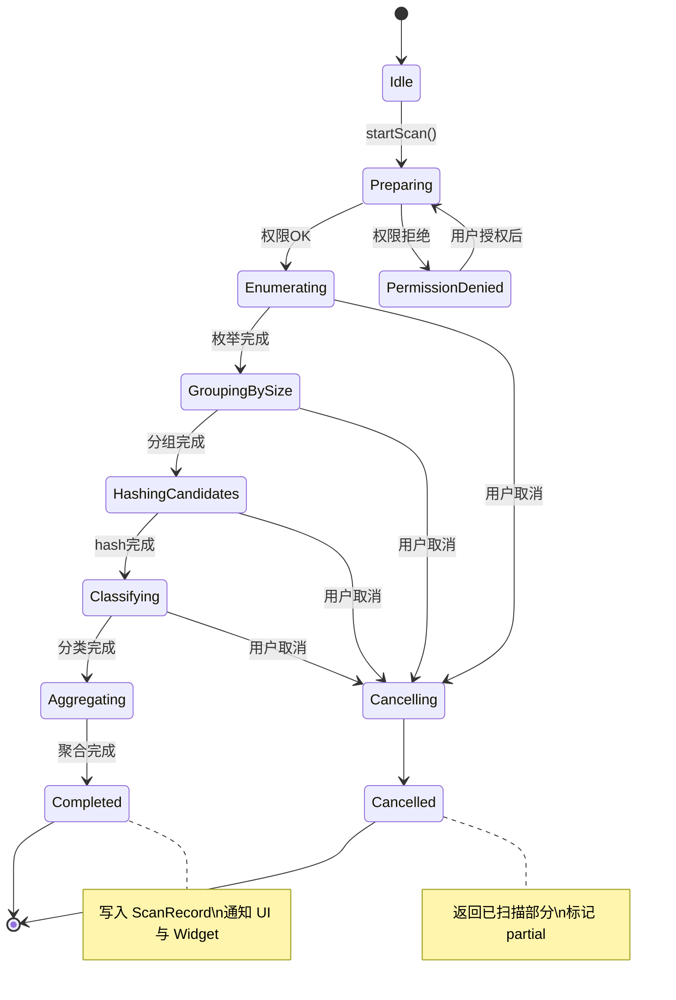
```mermaid
stateDiagram-v2
    [*] --> Idle
    Idle --> Preparing: startScan()
    Preparing --> Enumerating: 权限OK
    Preparing --> PermissionDenied: 权限拒绝
    PermissionDenied --> Preparing: 用户授权后
    Enumerating --> GroupingBySize: 枚举完成
    GroupingBySize --> HashingCandidates: 分组完成
    HashingCandidates --> Classifying: hash完成
    Classifying --> Aggregating: 分类完成
    Aggregating --> Completed: 聚合完成

    Enumerating --> Cancelling: 用户取消
    GroupingBySize --> Cancelling: 用户取消
    HashingCandidates --> Cancelling: 用户取消
    Classifying --> Cancelling: 用户取消

    Cancelling --> Cancelled
    Completed --> [*]
    Cancelled --> [*]

    note right of Completed: 写入 ScanRecord\n通知 UI 与 Widget
    note right of Cancelled: 返回已扫描部分\n标记 partial
```

### 7.2 清理任务状态机

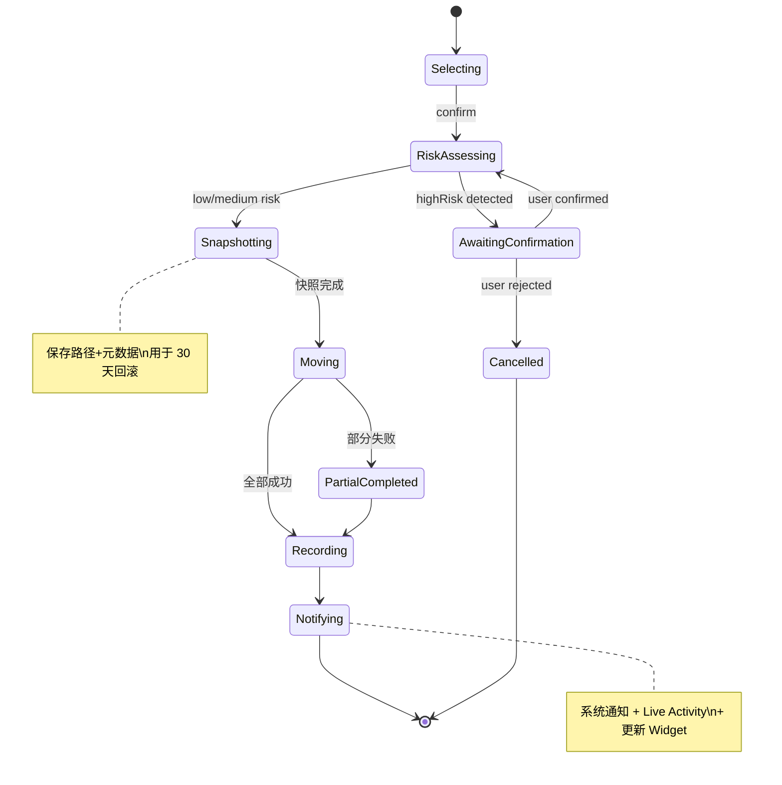
```mermaid
stateDiagram-v2
    [*] --> Selecting
    Selecting --> RiskAssessing: confirm
    RiskAssessing --> AwaitingConfirmation: highRisk detected
    AwaitingConfirmation --> RiskAssessing: user confirmed
    AwaitingConfirmation --> Cancelled: user rejected
    RiskAssessing --> Snapshotting: low/medium risk
    Snapshotting --> Moving: 快照完成
    Moving --> PartialCompleted: 部分失败
    Moving --> Recording: 全部成功
    Recording --> Notifying
    Notifying --> [*]

    PartialCompleted --> Recording
    Cancelled --> [*]

    note right of Snapshotting: 保存路径+元数据\n用于 30 天回滚
    note right of Notifying: 系统通知 + Live Activity\n+ 更新 Widget
```

### 7.3 Widget Timeline Provider 状态

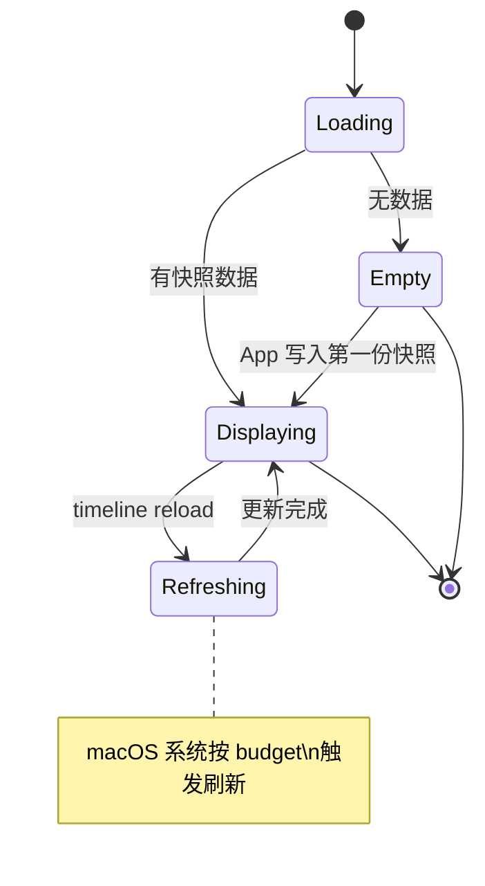
```mermaid
stateDiagram-v2
    [*] --> Loading
    Loading --> Displaying: 有快照数据
    Loading --> Empty: 无数据
    Empty --> Displaying: App 写入第一份快照
    Displaying --> Refreshing: timeline reload
    Refreshing --> Displaying: 更新完成
    Displaying --> [*]
    Empty --> [*]

    note right of Refreshing: macOS 系统按 budget\n触发刷新
```

---

## 8. 时序图

### 8.1 端到端"扫描→清理"主流程

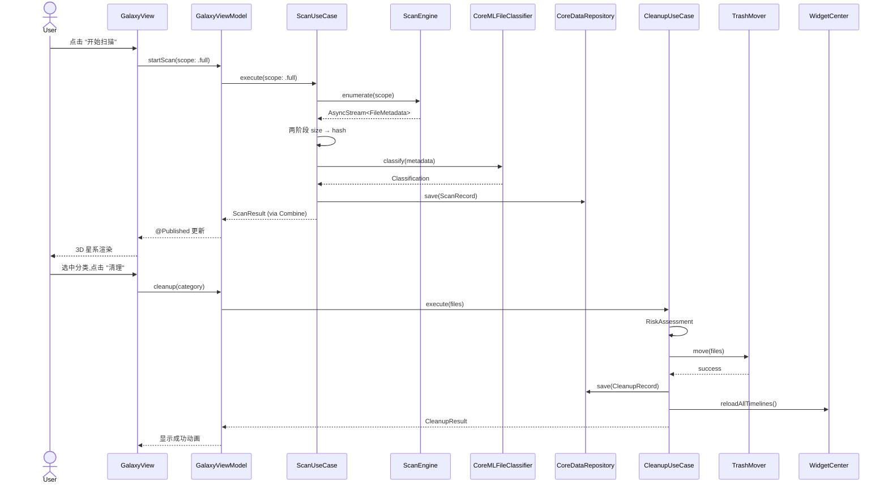
```mermaid
sequenceDiagram
    actor User
    participant View as GalaxyView
    participant VM as GalaxyViewModel
    participant UC as ScanUseCase
    participant Engine as ScanEngine
    participant Classifier as CoreMLFileClassifier
    participant Repo as CoreDataRepository
    participant Clean as CleanupUseCase
    participant Trash as TrashMover
    participant Widget as WidgetCenter

    User->>View: 点击 "开始扫描"
    View->>VM: startScan(scope: .full)
    VM->>UC: execute(scope: .full)
    UC->>Engine: enumerate(scope)
    Engine-->>UC: AsyncStream<FileMetadata>
    UC->>UC: 两阶段 size → hash
    UC->>Classifier: classify(metadata)
    Classifier-->>UC: Classification
    UC->>Repo: save(ScanRecord)
    UC-->>VM: ScanResult (via Combine)
    VM-->>View: @Published 更新
    View-->>User: 3D 星系渲染

    User->>View: 选中分类,点击 "清理"
    View->>VM: cleanup(category)
    VM->>Clean: execute(files)
    Clean->>Clean: RiskAssessment
    Clean->>Trash: move(files)
    Trash-->>Clean: success
    Clean->>Repo: save(CleanupRecord)
    Clean->>Widget: reloadAllTimelines()
    Clean-->>VM: CleanupResult
    VM-->>View: 显示成功动画
```

### 8.2 Widget 一键清理（macOS 14+ Interactive）

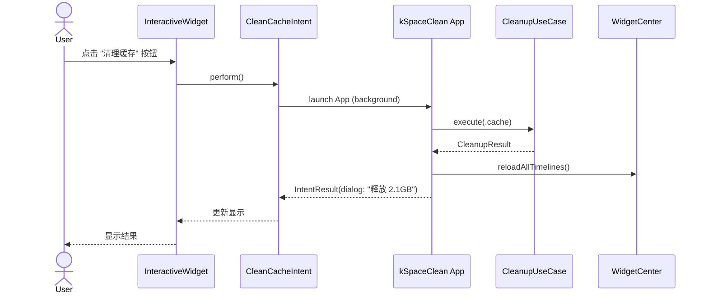
```mermaid
sequenceDiagram
    actor User
    participant Widget as InteractiveWidget
    participant Intent as CleanCacheIntent
    participant App as kSpaceClean App
    participant UC as CleanupUseCase
    participant WidgetCenter as WidgetCenter

    User->>Widget: 点击 "清理缓存" 按钮
    Widget->>Intent: perform()
    Intent->>App: launch App (background)
    App->>UC: execute(.cache)
    UC-->>App: CleanupResult
    App->>WidgetCenter: reloadAllTimelines()
    App-->>Intent: IntentResult(dialog: "释放 2.1GB")
    Intent-->>Widget: 更新显示
    Widget-->>User: 显示结果
```

### 8.3 Live Activity 进度同步

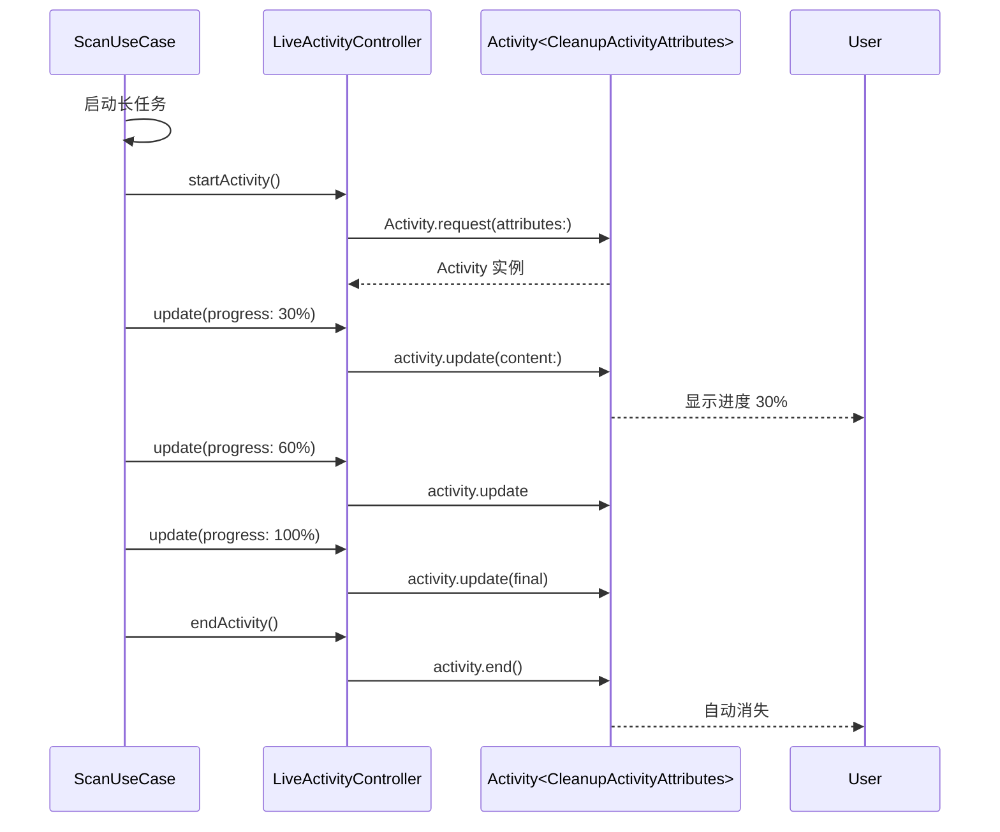
```mermaid
sequenceDiagram
    participant UC as ScanUseCase
    participant LA as LiveActivityController
    participant Activity as Activity<CleanupActivityAttributes>
    participant User

    UC->>UC: 启动长任务
    UC->>LA: startActivity()
    LA->>Activity: Activity.request(attributes:)
    Activity-->>LA: Activity 实例
    UC->>LA: update(progress: 30%)
    LA->>Activity: activity.update(content:)
    Activity-->>User: 显示进度 30%
    UC->>LA: update(progress: 60%)
    LA->>Activity: activity.update
    UC->>LA: update(progress: 100%)
    LA->>Activity: activity.update(final)
    UC->>LA: endActivity()
    LA->>Activity: activity.end()
    Activity-->>User: 自动消失
```

---

## 9. 关键模块详细设计

### 9.1 FileScanner（kFoundation 核心）

```swift
public protocol FileScannerProtocol: Sendable {
    func enumerate(
        scope: ScanScope,
        options: ScanOptions
    ) -> AsyncThrowingStream<FileMetadata, Error>

    func hash(_ url: URL, algorithm: HashAlgorithm) async throws -> String
    func hash(_ urls: [URL], algorithm: HashAlgorithm) async throws -> [URL: String]

    func findDuplicates(
        in scope: ScanScope,
        minSize: Int64
    ) -> AsyncThrowingStream<DuplicateGroup, Error>
}

public enum ScanScope: Sendable {
    case full
    case userHome
    case custom(URL)
}

public struct ScanOptions: Sendable {
    let followSymlinks: Bool = false
    let skipHiddenFiles: Bool = true
    let skipPackageContents: Bool = false
    let maxDepth: Int?
    let concurrentWorkers: Int = 8
}

public enum HashAlgorithm: Sendable {
    case sha256
    case md5
}

public struct DuplicateGroup: Sendable {
    let hash: String
    let size: Int64
    let files: [URL]
}
```

**实现要点**：
- 使用 `TaskGroup` 并发控制（默认 8 worker）
- `AsyncThrowingStream` 支持取消（`Task.cancel()` 即时停止）
- URLResourceKey 一次性获取元数据，避免多次 stat
- hash 缓存：相同 size + 同一 inode 跳过 hash

### 9.2 CoreML 分类器

```swift
public final class CoreMLFileClassifier: FileClassifier, @unchecked Sendable {
    private let model: MLModel
    private let provider: MLPredictionOptions

    public init(modelURL: URL) throws {
        self.model = try MLModel(contentsOf: modelURL)
        self.provider = MLPredictionOptions()
        if #available(macOS 14.0, *) {
            self.provider.computeUnits = .cpuAndNeuralEngine
        }
    }

    public func classify(_ entry: FileMetadata) async -> Classification {
        do {
            let input = try makeInput(from: entry)
            let output = try await model.prediction(from: input)
            return parseOutput(output)
        } catch {
            return fallbackToRules(entry)
        }
    }
}
```

**降级链路**：
1. CoreML 推理失败 → RuleBasedFileClassifier
2. 规则也匹配不上 → `.other` 类别（confidence = 0）

### 9.3 GalaxyRenderer（Metal 渲染）

```swift
public protocol GalaxyRenderer: AnyObject {
    func render(items: [GalaxyItem]) -> SCNNode
    func update(_ rootNode: SCNNode, with items: [GalaxyItem], animated: Bool)
}

public final class MetalGalaxyRenderer: GalaxyRenderer {
    private let device: MTLDevice
    private let commandQueue: MTLCommandQueue
    private let pipelineState: MTLRenderPipelineState

    public init() throws {
        guard let device = MTLCreateSystemDefaultDevice() else {
            throw GalaxyError.noMetalDevice
        }
        self.device = device
        self.commandQueue = device.makeCommandQueue()!
        self.pipelineState = try buildPipeline(device: device)
    }

    public func render(items: [GalaxyItem]) -> SCNNode {
        let rootNode = SCNNode()
        for item in items {
            let sphere = makeSphere(for: item)
            rootNode.addChildNode(sphere)
        }
        return rootNode
    }
}
```

**降级**：
- macOS 13 / 非 Apple Silicon：使用 SCNGeometry 简化版，关闭光线追踪
- 不支持 Metal 的设备：纯 SwiftUI `Canvas` 渲染 2D 圆点

### 9.4 PermissionCenter

```swift
public actor PermissionCenter {
    public static let shared = PermissionCenter()

    private var observers: [UUID: AsyncStream<PermissionState>.Continuation] = [:]

    public func currentState() -> PermissionState {
        if hasFullDiskAccess() {
            return .fullDiskAccess
        }
        // ... 其他状态判断
    }

    public func requestFDA() async -> Bool {
        // 触发系统弹窗（实际上 macOS FDA 是用户在系统设置手动授权）
        // 这里只是引导用户去设置
        await openSystemSettings()
        return await waitForAuthorization(timeout: 60)
    }

    public func startObserving() -> AsyncStream<PermissionState> {
        // 定时轮询 TCC 状态（macOS 没有 TCC 变化通知 API）
        AsyncStream { continuation in
            Task {
                while !Task.isCancelled {
                    let state = currentState()
                    continuation.yield(state)
                    try? await Task.sleep(for: .seconds(2))
                }
            }
        }
    }
}
```

### 9.5 Widget Snapshot 同步

```swift
public final class WidgetSnapshotService {
    private let appGroupURL: URL
    private let fileName = "widget-snapshot.json"

    public init() {
        self.appGroupURL = FileManager.default
            .containerURL(forSecurityApplicationGroupIdentifier: "group.app.kraftly.shared")!
    }

    public func write(_ summary: WidgetStorageSummary) throws {
        let url = appGroupURL.appendingPathComponent(fileName)
        let data = try JSONEncoder().encode(summary)
        try data.write(to: url, options: .atomic)
        WidgetCenter.shared.reloadAllTimelines()
    }

    public func read() throws -> WidgetStorageSummary? {
        let url = appGroupURL.appendingPathComponent(fileName)
        guard let data = try? Data(contentsOf: url) else { return nil }
        return try JSONDecoder().decode(WidgetStorageSummary.self, from: data)
    }
}
```

---

## 10. 错误处理策略

### 10.1 错误分类

| 类别 | 示例 | 处理 |
|---|---|---|
| **可恢复** | TCC 权限失效、磁盘临时不可用 | 重试 + UI 引导 |
| **用户可解决** | FDA 未授权、外接磁盘断开 | 引导用户操作 |
| **不可恢复** | CoreML 模型损坏、Core Data 损坏 | 降级到备份实现 + 上报 MetricKit |
| **安全相关** | 用户取消、清理失败 | 静默 + 日志 |

### 10.2 错误传播层级

```
Infrastructure 抛原始 Error
        ↓
UseCase 包装为 DomainError (含上下文)
        ↓
ViewModel 转换为 UserFacingError (含本地化消息)
        ↓
View 显示错误 UI (含操作建议)
```

### 10.3 自定义错误类型

```swift
public enum DomainError: LocalizedError {
    case permissionDenied(PermissionType)
    case scanCancelled
    case fileNotFound(URL)
    case trashFailed(URL, underlying: Error)
    case databaseCorrupted
    case modelLoadFailed(String)

    public var errorDescription: String? {
        switch self {
        case .permissionDenied(let type):
            return "需要\(type.displayName)权限"
        case .scanCancelled:
            return "扫描已取消"
        // ...
        }
    }
}
```

---

## 11. 性能预算

| 模块 | 性能目标 | 测量方式 |
|---|---|---|
| 扫描 100GB | < 5 分钟 | Instruments Time Profiler |
| Hash 10000 个 1MB 文件 | < 60 秒 | XCTest 基准 |
| 3D 渲染 (M1) | 60 fps | CADisplayLink |
| AI 分类 10000 文件 | < 30 秒 | XCTest 基准 |
| 内存占用（空闲） | < 150 MB | Allocations |
| 内存占用（扫描中） | < 400 MB | Allocations |
| App 冷启动 | < 1.5 秒 | Instruments App Launch |

---

## 12. 测试策略细化

### 12.1 测试金字塔

```
        ╱╲
       ╱  ╲         E2E (XCUITest)
      ╱────╲         关键用户路径
     ╱      ╲
    ╱────────╲       Integration (XCTest)
   ╱          ╲      跨模块协同
  ╱────────────╲
 ╱              ╲   Unit (XCTest + Swift Testing)
╱────────────────╲  ViewModel / UseCase / Repository
```

### 12.2 关键测试用例

| 模块 | 测试类型 | 关键场景 |
|---|---|---|
| FileScanner | 集成 | 扫描含 10k 文件的目录、性能基准 |
| AI Classifier | 单元 | CoreML 失败回退、置信度阈值 |
| TrashMover | 集成 | 大文件移动、外接磁盘、权限拒绝 |
| PermissionCenter | 单元 mock TCC | FDA 状态转换 |
| GalaxyRenderer | 视觉测试 | 截图对比 baseline |
| Widget | UI 测试 | Interactive Widget 触发 intent |
| Live Activity | 单元 mock ActivityKit | 进度更新 |

---

## 13. 构建与发布

### 13.1 Build 配置

| 配置 | Debug | Release |
|---|---|---|
| 优化级别 | `-Onone` | `-O` |
| 符号 | 包含 | dSYM 分离 |
| 断言 | 启用 | 禁用 |
| MetricKit | 启用 | 启用 |
| Log 级别 | .debug | .info |

### 13.2 自动化脚本

```bash
# Tools/release.sh
set -e
VERSION=$1
APP_NAME="kSpaceClean"

# 1. 构建
xcodebuild -workspace KraftlyWorkspace.xcworkspace \
  -scheme kSpaceClean \
  -configuration Release \
  -archivePath build/$APP_NAME.xcarchive

# 2. 签名 + 打包
xcodebuild -exportArchive \
  -archivePath build/$APP_NAME.xcarchive \
  -exportPath build/$APP_NAME-$VERSION \
  -exportOptionsPlist Tools/ExportOptions.plist

# 3. 上传至 App Store Connect
xcrun altool --upload-app \
  -f build/$APP_NAME-$VERSION/$APP_NAME.pkg \
  -u $APPLE_ID
```

### 13.3 版本号策略

- **主版本**：v1.0 / v2.0（破坏性变更）
- **次版本**：v1.1 / v1.2（新功能）
- **补丁版本**：v1.1.1（bug 修复）

---

## 14. 实施阶段任务映射

本设计文档中的每一节都对应一个或多个 writing-plans 阶段任务：

| 设计章节 | 对应任务类别 |
|---|---|
| §1 分层架构 | Workspace 搭建 + 模块划分 |
| §2 架构模式 | 模板代码 + 基类 |
| §4 流程图 | Feature 实现 |
| §5 类图 | 类骨架 |
| §6 数据模型 | Core Data 栈 |
| §7 状态机 | Feature 实现 |
| §8 时序图 | 集成测试 |
| §9 模块详细设计 | 各模块编码 |
| §10 错误处理 | 错误类型定义 + UI |
| §11 性能预算 | 性能基准测试 |
| §12 测试策略 | 测试代码 |
| §13 构建发布 | CI/CD 配置 |

---

## 15. 可访问性架构

### 15.1 双视图设计

```mermaid
graph LR
    A[Galaxy View<br/>3D 可视化] -->|默认| B[主视图]
    A -.->|accessibility rotor| C[List View<br/>Accessible Alternative]
    C --> D[Table 组件<br/>完整 VoiceOver]
    B --> E{Reduce Motion?}
    E -->|Yes| F[降级动效]
    E -->|No| G[完整动效]
```

### 15.2 Accessibility 协议

```swift
public protocol AccessibilityProviding {
    var accessibilityLabel: String { get }
    var accessibilityHint: String { get }
    var accessibilityTraits: NSAccessibilityTraits { get }
    var accessibilityValue: Any? { get }
}

public struct GalaxyItemAccessibility: AccessibilityProviding {
    let item: GalaxyItem
    var accessibilityLabel: String {
        "\(item.category.displayName), \(ByteFormatter.format(item.size))"
    }
    var accessibilityHint: String { "Activate to view files in this category" }
    var accessibilityTraits: NSAccessibilityTraits { .button }
    var accessibilityValue: Any? { "\(item.fileCount) files" }
}
```

### 15.3 GalaxyItem accessibility 标注

```swift
// MetalGalaxyRenderer 中
public func render(items: [GalaxyItem]) -> SCNNode {
    let rootNode = SCNNode()
    for item in items {
        let sphere = makeSphere(for: item)
        // 关键：为每个 3D 球添加 accessibility 元数据
        sphere.accessibilityLabel = "\(item.category.displayName), \(ByteFormatter.format(item.size))"
        sphere.accessibilityHint = "Activate to view files"
        sphere.accessibilityTraits = .button
        sphere.setAccessibilityElement(true)
        rootNode.addChildNode(sphere)
    }
    return rootNode
}
```

### 15.4 ListView 替代视图

```swift
struct AccessibleListView: View {
    @ObservedObject var viewModel: GalaxyViewModel

    var body: some View {
        Table(viewModel.results, columns: {
            TableColumn("Category") { item in
                Label(item.category.displayName, systemImage: item.category.iconName)
            }
            TableColumn("Size") { item in
                Text(ByteFormatter.format(item.size))
            }
            TableColumn("Files") { item in
                Text("\(item.fileCount)")
            }
        })
        .accessibilityLabel("Storage breakdown")
        .accessibilityHint("Use arrow keys to navigate categories")
    }
}
```

### 15.5 Reduce Motion 降级

```swift
public final class MotionPreferences {
    public static var reduceMotion: Bool {
        NSWorkspace.shared.accessibilityDisplayShouldReduceMotion
    }

    public static func animationDuration(_ base: Double) -> Double {
        reduceMotion ? 0 : base
    }
}

// 使用
withAnimation(.easeInOut(duration: MotionPreferences.animationDuration(0.3))) {
    // ...
}
```

### 15.6 快捷键定义

```swift
public enum AppShortcuts {
    public static let scan = KeyboardShortcut("s", modifiers: .command)
    public static let clean = KeyboardShortcut("c", modifiers: [.command, .shift])
    public static let settings = KeyboardShortcut(",", modifiers: .command)
    public static let help = KeyboardShortcut("?", modifiers: .command)
}
```

### 15.7 测试用例（Accessibility）

| 用例 | 工具 | 通过标准 |
|---|---|---|
| VoiceOver 走完扫描流程 | VoiceOver + XCUITest | 所有球可朗读、可激活 |
| 全键盘操作 | 手动测试 + XCUITest | 无需鼠标可完成所有任务 |
| Reduce Motion 模式 | 系统设置切换 | 动效关闭，结果直接呈现 |
| 高对比度模式 | 系统设置切换 | 对比度 ≥ 4.5:1 |
| Dynamic Type | 系统设置切换 | 字号正常缩放 |

---

## 16. MetricKit 监控架构

### 16.1 订阅者实现

```swift
public final class MetricKitSubscriber: NSObject, MXMetricManagerSubscriber {
    private let storage: MetricStorage

    public init(storage: MetricStorage = .local) {
        self.storage = storage
        super.init()
    }

    public func start() {
        MXMetricManager.shared.add(self)
    }

    public func stop() {
        MXMetricManager.shared.remove(self)
    }

    // 性能指标（每小时上报）
    public func didReceive(_ payloads: [MXMetricPayload]) {
        for payload in payloads {
            storage.save(payload)
        }
    }

    // 崩溃诊断（即时上报）
    public func didReceive(_ payloads: [MXDiagnosticPayload]) {
        for payload in payloads {
            storage.save(payload)
            handleCrash(payload)
        }
    }

    private func handleCrash(_ payload: MXDiagnosticPayload) {
        // 1. 记录到本地 CrashLog
        // 2. 更新崩溃统计
        // 3. 显示"上版本有崩溃，是否上报？"提示（如未来启用）
    }
}
```

### 16.2 本地存储

```swift
public actor MetricStorage {
    private let directory: URL

    public init() {
        let appSupport = FileManager.default.urls(
            for: .applicationSupportDirectory, in: .userDomainMask
        ).first!
        self.directory = appSupport.appendingPathComponent("metrics")
        try? FileManager.default.createDirectory(at: directory, withIntermediateDirectories: true)
    }

    public func save(_ payload: MXMetricPayload) {
        let url = directory.appendingPathComponent("\(payload.timeStampBegin.timeIntervalSince1970).json")
        if let data = try? JSONEncoder().encode(payload.jsonRepresentation()) {
            try? data.write(to: url)
        }
    }

    public func recentCrashes(limit: Int = 50) -> [CrashRecord] {
        // 读取并解析最近的崩溃记录
    }
}
```

### 16.3 监控指标

| 指标 | 数据源 | 用途 |
|---|---|---|
| **崩溃率** | MXCrashDiagnostic | 跟踪稳定性 |
| **卡顿** | MXHangDiagnostic | 发现性能问题 |
| **CPU 使用** | MXAppLaunchMetric + MXAnimationMetric | 启动 + 动效性能 |
| **内存峰值** | MXMemoryMetric | 内存泄漏检测 |
| **电池影响** | MXAppRunTimeMetric | 功耗评估 |
| **磁盘写入** | MXDiskIOMetric | Core Data / 文件 IO 监控 |

### 16.4 数据流（完全本地）

```mermaid
flowchart LR
    A[App Runtime] -->|MXMetricManager| B[MetricKitSubscriber]
    B -->|本地存储| C[App Support<br/>metrics/*.json]
    C -->|开发者本地读取| D[分析仪表盘]
    C -.->|❌ 永不离开设备| E[网络]

    style E fill:#fee
```

> **关键承诺**：所有 MetricKit 数据仅本地存储，**永不离开设备**。如未来改变此原则，必须先更新隐私标签（§14.6）并获得用户 opt-in。

---

## 17. CI/CD 架构

### 17.1 V1 阶段（手动）

```bash
# Tools/release.sh
set -e
VERSION=$1
APP_NAME="kSpaceClean"

# 1. 测试
xcodebuild test \
  -workspace KraftlyWorkspace.xcworkspace \
  -scheme kSpaceClean \
  -destination 'platform=macOS'

# 2. Archive
xcodebuild archive \
  -workspace KraftlyWorkspace.xcworkspace \
  -scheme kSpaceClean \
  -configuration Release \
  -archivePath build/$APP_NAME.xcarchive

# 3. 导出 + 上传
xcodebuild -exportArchive \
  -archivePath build/$APP_NAME.xcarchive \
  -exportPath build/$APP_NAME-$VERSION \
  -exportOptionsPlist Tools/ExportOptions.plist

xcrun altool --upload-app \
  -f build/$APP_NAME-$VERSION/$APP_NAME.pkg \
  -u $APPLE_ID
```

### 17.2 V1.1 升级（GitHub Actions）

```yaml
# .github/workflows/ci.yml
name: CI

on:
  pull_request:
  push:
    branches: [main, develop]

jobs:
  test:
    runs-on: macos-14
    steps:
      - uses: actions/checkout@v4
      - name: Select Xcode
        run: sudo xcode-select -s /Applications/Xcode_15.4.app
      - name: Build & Test
        run: |
          xcodebuild test \
            -workspace KraftlyWorkspace.xcworkspace \
            -scheme kSpaceClean \
            -destination 'platform=macOS' \
            -resultBundlePath build/test.xcresult
      - name: Upload Test Results
        if: always()
        uses: actions/upload-artifact@v4
        with:
          name: test-results
          path: build/test.xcresult

  lint:
    runs-on: macos-14
    steps:
      - uses: actions/checkout@v4
      - name: SwiftLint
        run: |
          brew install swiftlint
          swiftlint lint --strict

  release:
    if: github.ref == 'refs/heads/main'
    needs: [test, lint]
    runs-on: macos-14
    steps:
      - uses: actions/checkout@v4
      - name: Archive & Upload
        env:
          APPLE_ID: ${{ secrets.APPLE_ID }}
          APP_PASSWORD: ${{ secrets.APP_PASSWORD }}
        run: bash Tools/release.sh ${{ github.ref_name }}
```

### 17.3 Fastlane 配置（V2 评估）

```ruby
# fastlane/Fastfile
default_platform(:mac)

platform :mac do
  desc "Run tests"
  lane :test do
    run_tests(
      workspace: "KraftlyWorkspace.xcworkspace",
      scheme: "kSpaceClean"
    )
  end

  desc "Build and upload to TestFlight"
  lane :beta do
    build_mac_app(
      workspace: "KraftlyWorkspace.xcworkspace",
      scheme: "kSpaceClean",
      output_directory: "./build"
    )
    upload_to_testflight
  end

  desc "Release to App Store"
  lane :release do
    build_mac_app(
      workspace: "KraftlyWorkspace.xcworkspace",
      scheme: "kSpaceClean",
      export_method: "app-store"
    )
    upload_to_app_store
  end
end
```

---

## 18. Discord 社区架构

### 18.1 服务器结构

```
Kraftly Discord Server
├── 📢 announcements      # 新版本通知（仅管理员可发）
├── 👋 welcome            # 欢迎消息 + 服务器规则
├── 💬 general            # 用户闲聊
├── 💡 feature-requests   # 功能建议（用户 + 开发者讨论）
├── 🐛 bug-reports        # Bug 报告（模板化）
├── 🍎 mac-tips           # Mac 使用技巧
├── 🎨 show-and-tell      # 用户晒清理成果
├── 🌍 i18n-zh            # 中文频道
└── 🛠 dev-log            # 开发日志（开发者独白）
```

### 18.2 Bot 集成（可选）

```swift
// Discord Webhook 集成（仅开发者后台用，不在 App 内）
public struct DiscordWebhook {
    public static func postAnnouncement(_ message: String) async throws {
        let url = URL(string: "https://discord.com/api/webhooks/...")!
        var request = URLRequest(url: url)
        request.httpMethod = "POST"
        request.setValue("application/json", forHTTPHeaderField: "Content-Type")
        let body = ["content": message]
        request.httpBody = try JSONEncoder().encode(body)
        _ = try await URLSession.shared.data(for: request)
    }
}
```

### 18.3 运营节奏

| 时段 | 动作 |
|---|---|
| 每天 | 检查 bug-reports + feature-requests |
| 每周一 | 发布 dev-log 周报 |
| 每月 | 社区 AMA（开发者答疑） |

---

## 19. 实施阶段任务映射（更新）

本设计文档中的每一节都对应一个或多个 writing-plans 阶段任务：

| 设计章节 | 对应任务类别 |
|---|---|
| §1 分层架构 | Workspace 搭建 + 模块划分 |
| §2 架构模式 | 模板代码 + 基类 |
| §4 流程图 | Feature 实现 |
| §5 类图 | 类骨架 |
| §6 数据模型 | Core Data 栈 |
| §7 状态机 | Feature 实现 |
| §8 时序图 | 集成测试 |
| §9 模块详细设计 | 各模块编码 |
| §10 错误处理 | 错误类型定义 + UI |
| §11 性能预算 | 性能基准测试 |
| §12 测试策略 | 测试代码 |
| §13 构建发布 | CI/CD 配置 |
| §15 可访问性 | AccessibilityProviding 协议 + ListView + Reduce Motion |
| §16 MetricKit | MXMetricManager 订阅 + 本地存储 |
| §17 CI/CD | GitHub Actions workflow |
| §18 Discord | 服务器配置 + Bot 集成 |

---

## 附录：图例

本文档使用 Mermaid 语法绘制图表。可在以下环境渲染：
- GitHub / GitLab Markdown
- VS Code + Markdown Preview Mermaid Support 扩展
- Typora / Mark Text
- 在线渲染器 mermaid.live

如需修改图表，编辑 Mermaid 代码块即可，CI 可自动重新生成 PNG。

---

**文档结束**。配套主 spec：[2026-07-25-kraftly-kspaceclean-design.md](./2026-07-25-kraftly-kspaceclean-design.md)