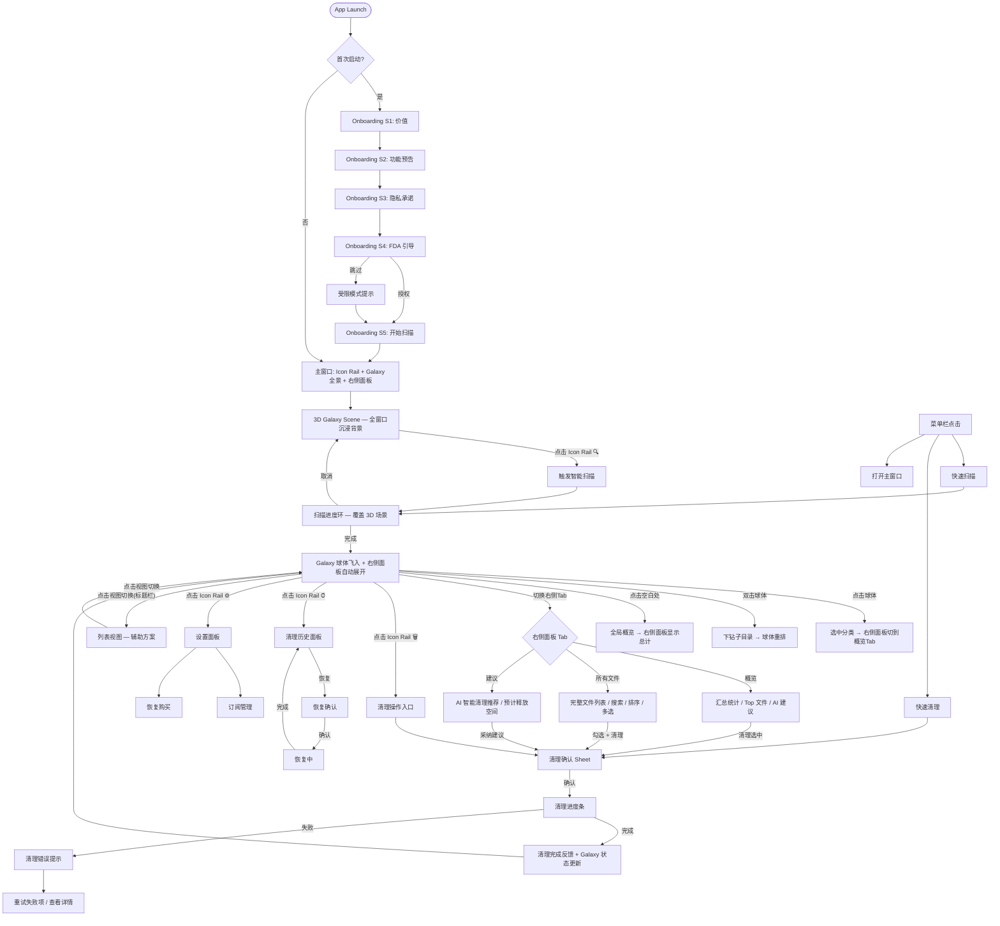

# kSpaceClean v1 UI 交互设计

**配套文档**：[2026-07-25-kraftly-kspaceclean-design.md](./2026-07-25-kraftly-kspaceclean-design.md)
**目标**：定义完整的用户界面、交互流程、组件体系与设计规范
**版本**：v1（首发完整版）

---

## 1. 设计系统基础

### 1.1 品牌色板

| Token | 色值 | 用途 |
|---|---|---|
| `brand-primary` | `#7C3AED` (紫) | 主品牌色、强调按钮、选中态 |
| `brand-secondary` | `#3B82F6` (蓝) | 辅助色、链接、信息提示 |
| `brand-accent` | `#F59E0B` (橙) | 提亮色、促销标签、推荐标记 |
| `success` | `#10B981` (绿) | 清理完成、授权通过、正反馈 |
| `danger` | `#EF4444` (红) | 高风险警告、错误状态、删除操作 |
| `warning` | `#F97316` (橙红) | 磁盘空间不足、低电量、中等风险 |

**语义化映射**：

```
文件分类色板 → 3D 球体
  image    #A855F7 (紫)
  video    #3B82F6 (蓝)
  document #10B981 (绿)
  audio    #F59E0B (橙)
  cache    #6B7280 (灰)
  dev      #EC4899 (粉)
  app      #8B5CF6 (靛)
  other    #9CA3AF (浅灰)
```

### 1.2 明暗模式

| 层级 Token | Light | Dark |
|---|---|---|
| `bg-primary` | `#FFFFFF` | `#1C1C1E` |
| `bg-secondary` | `#F5F5F7` | `#2C2C2E` |
| `bg-tertiary` | `#E8E8ED` | `#3A3A3C` |
| `text-primary` | `#1D1D1F` | `#F5F5F7` |
| `text-secondary` | `#6E6E73` | `#98989D` |
| `separator` | `#D2D2D7` | `#48484A` |
| `fill-glass` | `rgba(255,255,255,0.7)` | `rgba(28,28,30,0.7)` |

### 1.3 字体层级

| 样式 | Size | Weight | 用途 |
|---|---|---|---|
| `.large-title` | 26px | Bold | 欢迎屏标题 |
| `.title2` | 20px | Semibold | 章节标题 |
| `.title3` | 16px | Semibold | 卡片标题 |
| `.body` | 13px | Regular | 正文 |
| `.callout` | 12px | Regular | 辅助说明 |
| `.caption` | 11px | Regular | 标签、时间戳 |
| `.mono-digit` | 13px | Regular | 文件大小数字 |

> 全部使用 SF Pro（系统默认字体），无需引入外部字体。

### 1.4 间距网格

基础单位 = 4pt

| Token | 值 | 用途 |
|---|---|---|
| `spacing-xs` | 4pt | 图标与文字间距 |
| `spacing-sm` | 8pt | 列表项内间距 |
| `spacing-md` | 12pt | 卡片内容间距 |
| `spacing-lg` | 16pt | 组件间间距 |
| `spacing-xl` | 24pt | Section 间距 |
| `spacing-2xl` | 32pt | 大区块间距 |
| `spacing-3xl` | 48pt | 窗口边距 |

### 1.5 圆角

| Token | 值 | 用途 |
|---|---|---|
| `radius-sm` | 4pt | 小标签、badge |
| `radius-md` | 6pt | 按钮、输入框 |
| `radius-lg` | 8pt | 卡片、弹窗 |
| `radius-xl` | 12pt | Sheet、面板 |
| `radius-full` | 999px | 头像、圆形指示器 |

### 1.6 阴影

| Token | Light | Dark |
|---|---|---|
| `shadow-sm` | 0 1px 2px rgba(0,0,0,0.05) | 0 1px 2px rgba(0,0,0,0.3) |
| `shadow-md` | 0 4px 8px rgba(0,0,0,0.08) | 0 4px 8px rgba(0,0,0,0.4) |
| `shadow-lg` | 0 8px 24px rgba(0,0,0,0.12) | 0 8px 24px rgba(0,0,0,0.5) |

### 1.7 图标体系

- **来源**：SF Symbols 5（系统内置，macOS 13+ 原生支持）
- **风格**：`monochrome` 为主，`hierarchical` 用于文件分类图标
- **尺寸**：`NSImageSymbolScale` small / medium / large 三级
- **关键图标映射**：

| 功能 | SF Symbol | 分级 |
|---|---|---|
| 磁盘星系 | `sparkles.rectangle.stack` | Primary |
| 智能扫描 | `magnifyingglass.circle` | Primary |
| 清理 | `trash` | Danger |
| 历史 | `clock.arrow.circlepath` | Secondary |
| 设置 | `gearshape` | Secondary |
| 订阅 | `crown` | Accent |
| FDA 权限 | `lock.shield` | Primary |
| 3D/列表切换 | `square.grid.3d.up.square` / `list.bullet` | Toggle |

---

## 2. 窗口架构

### 2.1 主窗口规格

| 属性 | 值 |
|---|---|
| 默认尺寸 | 960 × 660 pt |
| 最小尺寸 | 800 × 540 pt |
| 最大尺寸 | 无限制（跟随屏幕） |
| 样式 | `NSWindow.StyleMask` 全功能（关闭/最小化/缩放/标题栏） |
| Titlebar | 隐藏 titlebar，custom toolbar |
| 保存 | 自动保存窗口位置与尺寸 |

### 2.2 窗口布局

```
┌──────────────────────────────────────────────────────────┐
│  ⬤ ⬤ ⬤  kSpaceClean — Pro          🔍 搜索文件...       │
│  ┌──┐ ┌──────────────────────────┐ ┌────────────────────┐ │
│  │🪐 │ │                          │ │ 🖼 图片            │ │
│  │🔍 │ │    3D Galaxy Scene       │ │ 42.3 GB · 1,234 个│ │
│  │🗑 │ │    (Metal 渲染, 全窗口)   │ │ ┌──── Tab ────┐  │ │
│  │⏱ │ │                          │ │ │概览│所有文件│建议│ │
│  │  │ │  ● 球体群集               │ │ ├─────────────┤  │ │
│  │⚙ │ │   按大小排列              │ │ │ 最大文件      │  │ │
│  └──┘ │   按类型上色              │ │ │ 🖼 IMG_01     │  │ │
│       │                          │ │ │   342 MB       │  │ │
│       │                          │ │ │ 🖼 DSC_02      │  │ │
│       └──────────────────────────┘ │ │   128 MB       │  │ │
│  🟣图片 🔵视频 🟢文档 🟠音频 ⚪缓存│ │ ...查看全部 →  │  │ │
│  ┌──────────────────────────────┐  │ ├─────────────┤  │ │ │
│  │ ■ 已用 128 GB ████████░░ 256│  │ │ 🤖 AI 建议:   │  │ │
│  │ [⬇ 快速扫描] [✨ 开始扫描]  │  │ │ 328 张相似照片 │  │ │
│  └──────────────────────────────┘  │ └─────────────┘  │ │
└──────────────────────────────────────────────────────────┘
```

**布局层级**（从底层到顶层）：

| 层级 | 内容 | 渲染方式 |
|---|---|---|
| 背景层 | 3D 星系场景（全窗口） | Metal + SceneKit |
| 导航层 | 左侧 Icon Rail (42pt) | NSVisualEffectView 毛玻璃 |
| 数据层 | 右侧浮动面板 (260pt, 可选折叠) | NSVisualEffectView 毛玻璃 |
| 信息层 | 底部浮动 Bar | NSVisualEffectView 毛玻璃 |
| 控制层 | 顶部分类图例 + 标题栏 | 半透明模糊背景 |

**设计要点**：
- 所有 UI 元素都是浮动毛玻璃面板，**不遮挡星系**
- 中央 3D 场景无任何覆盖，保持沉浸感
- 窗口缩放时 3D 场景自适应，面板保持相对位置

### 2.3 左侧导航设计 (Icon Rail)

- **宽度**：42pt 固定，不支持折起
- **样式**：竖排 Icon，悬停显示 Tooltip 文字
- **高亮**：brand-primary 紫色半透明底 + 白色 icon
- **分组**：上部=核心功能，下部=管理功能

| Icon | 功能 | 说明 |
|---|---|---|
| 🪐 | 星系 | 默认主页，3D 沉浸浏览 |
| 🔍 | 扫描 | 触发/管理扫描任务 |
| 🗑 | 清理 | 清理操作入口 + 回收站管理 |
| ⏱ | 历史 | 清理历史记录 + 恢复 |
| ⚙ | 设置 | 应用设置 + 订阅管理 |

### 2.4 标题栏交互

- **窗口控制点**：左上角红黄绿圆点（macOS 标准）
- **App 标题**：左上方显示 "kSpaceClean" + Pro 标签
- **搜索栏**：标题栏中央区域，内置搜索图标 + "搜索文件..." 占位文字
- **视图切换**：右上角轻量化 `星系 ⇔ 列表` 切换按钮（默认星系，列表为辅助方案）
- **毛玻璃**：整体背景使用 `NSVisualEffectView`，blur 20+

### 2.5 底部浮动面板

- **位置**：窗口底部，浮动在 3D 场景之上（不是固定在窗口边缘）
- **间距**：距窗口底部 10pt，距左右内容区 12pt
- **高度**：48pt
- **内容**：
  - 左：磁盘容量进度条（已用/总计，<70% 绿 / 70-90% 黄 / >90% 红）
  - 右：主操作按钮组
- **按钮分组**：
  - `⬇ 快速扫描` — 次要动作 outline 样式
  - `✨ 开始扫描` — 主要动作，渐变紫色背景 + shadow

### 2.6 分类图例

- **位置**：底部浮动面板上方，左侧距 Icon Rail 12pt
- **样式**：极简圆点 + 文字标签，半透明毛玻璃底
- **内容**：🟣图片 🔵视频 🟢文档 🟠音频 ⚪缓存 🔁重复
- **交互**：点击图例项 = 在星系中高亮对应分类

---

## 3. 页面级交互设计

### 3.1 Disk Galaxy（主页面）

#### 布局

```
┌─────────────────────────────────────────────────────────────┐
│  kSpaceClean — Pro              🔍 搜索文件...    星系 | 列表 │
├─────────────────────────────────────────────────────────────┤
│ ┌──┐ ┌──────────────────────────────────┐ ┌──────────────┐ │
│ │🪐 │ │                                  │ │ 🖼 图片       │ │
│ │🔍 │ │                                  │ │ 42.3 GB      │ │
│ │🗑 │ │   3D Metal SceneKit View          │ │ ┌──────────┐ │ │
│ │⏱ │ │   (全窗口沉浸)                     │ │ │概览│文件│建议│ │
│ │  │ │                                  │ │ ├──────────┤ │ │
│ │⚙ │ │  ● 紫色 = 图片  (42.3 GB)       │ │ │ 最大文件  │ │ │
│ │  │ │  ● 蓝色 = 视频  (28.1 GB)       │ │ │ IMG_01    │ │ │
│ └──┘ │  ● 绿色 = 文档  (12.4 GB)       │ │ │  342 MB   │ │ │
│      │  ● 橙色 = 音频  (6.2 GB)        │ │ │ DSC_02    │ │ │
│      │  ● 灰色 = 缓存  (8.2 GB)        │ │ │  128 MB   │ │ │
│      │  ● 粉色 = 重复  (2.7 GB)        │ │ │ ...       │ │ │
│      │                                  │ │ ├──────────┤ │ │
│      │                                  │ │ │🤖 建议:   │ │ │
│      │                                  │ │ │ 清理 328  │ │ │
│      └──────────────────────────────────┘ │ │ 相似照片  │ │ │
│  🟣图片 🔵视频 🟢文档 🟠音频 ⚪缓存        │ └──────────┘ │ │
│ ┌──────────────────────────────────────┐ └──────────────┘ │
│ │ ■ 已用 128 GB ████████░░ 256 GB     │                    │
│ │         [⬇ 快速扫描] [✨ 开始扫描]    │                    │
│ └──────────────────────────────────────┘                    │
└─────────────────────────────────────────────────────────────┘
```

**右侧面板 Tab 系统**（核心交互变更）：

| Tab | 显示内容 | 适用场景 |
|---|---|---|
| **概览** | 选中分类的汇总统计、Top 文件列表、AI 清理建议 | 浏览分类概览时 |
| **所有文件** | 完整的可搜索/可排序文件列表（全部结果，不限于选中） | 需要查看/筛选/选择文件时 |
| **建议** | AI 智能清理推荐列表，带置信度和预计释放空间 | 快速清理时 |

**面板行为**：
- 默认显示"概览"Tab，展示当前选中分类的信息
- 切换到"所有文件"Tab 后，显示完整文件列表（独立于选中分类）
- 面板宽度 260pt，支持通过拖拽调整宽度
- 支持通过按钮完全折叠面板（全屏沉浸模式）

**与旧版设计的区别**：
- ❌ 不再有两种独立视图模式（星系模式 / 列表模式）
- ✅ 星系始终为主界面，右侧面板统一承载详情 + 全部数据
- ❌ 不再有独立的 Smart Scan 结果页面

#### 3D 场景交互

| 手势 | 行为 |
|---|---|
| 拖拽旋转 | 围绕中心旋转视角（阻尼效果） |
| 双指缩放 | 拉近/拉远视角 |
| 点击球体 | 选中 → 右侧面板切换到"概览"Tab → 球体高亮 + 外发光 |
| 双击球体 | 下钻到子目录 → 路径面包屑更新 → 右侧面板刷新 |
| 右击球体 | 上下文菜单："在 Finder 中显示"、"清理此分类"、"查看文件" |
| 点击空白处 | 取消选中 → 右侧面板显示全局概览（所有分类总计） |
| 拖拽球体 | 重新排列（仅当前视图，不改变实际文件位置） |

#### 球体视觉规则

| 属性 | 规则 |
|---|---|
| 半径 | `0.5 + log2(size_in_GB + 1) * 0.3`（上限 3.0） |
| 颜色 | 按 `FileCategory` 映射 |
| 透明度 | 0.85（允许看到被遮挡的球体） |
| 标签 | Hover 时显示名称 + 大小 |
| 动画 | 缓慢自转（周期 30 秒），选中时暂停 |
| 选中高亮 | 外发光 glow + 轻微放大 1.1x |
| 文件类型图标 | 球体表面叠加对应 SF Symbol |

#### 球体表面 Icon 叠加

每个球体中心放置对应的 SF Symbol（白色，半透明描边）：

| 文件类型 | Icon | 球体色 |
|---|---|---|
| 图片 | `photo` | 紫 |
| 视频 | `video` | 蓝 |
| 文档 | `doc.text` | 绿 |
| 音频 | `music.note` | 橙 |
| 缓存 | `archivebox` | 灰 |
| 开发 | `chevron.left.forwardslash.chevron.right` | 粉 |
| 应用 | `app` | 靛 |
| 其他 | `questionmark.folder` | 浅灰 |

#### 空状态（未扫描）

```
┌──────────────────────────────────────┐
│                                      │
│          🧭  (大图标)                │
│                                      │
│      "你的磁盘还没有扫描"            │
│                                      │
│    "点击下方按钮开始智能扫描"        │
│                                      │
│     ┌──────────────────────┐        │
│     │  开始扫描            │        │
│     │  sparkles.magnifyingglass │  │
│     └──────────────────────┘        │
│                                      │
│   或直接把文件夹拖到这里             │
│                                      │
└──────────────────────────────────────┘
```

#### 加载状态（扫描中）

```
┌──────────────────────────────────────┐
│                                      │
│      ┌──────────────────────┐       │
│      │  进度环 (环形动画)     │       │
│      │  45%                 │       │
│      │  2.4GB / 5.3GB       │       │
│      └──────────────────────┘       │
│                                      │
│  正在扫描: /Users/xxx/Library/Caches │
│                                      │
│  已发现: 1,284 个文件 (3.2GB)       │
│                                      │
│  [取消]                              │
│                                      │
└──────────────────────────────────────┘
```

### 3.2 Smart Scan 结果页

**不再作为独立全窗口页面存在**。扫描结果直接呈现在 Galaxy 主界面的右侧面板中。

#### 扫描完成过渡

扫描完成后，3D 场景从"空状态"平滑过渡到"星系状态"：

1. 进度环渐出消失
2. 球体从星系中心旋转飞出，按大小排列
3. 右侧面板自动展开，显示"概览"Tab 的总计数据
4. 底部面板更新磁盘信息

#### 右侧面板数据呈现

| 元素 | 位置 | 来源 |
|---|---|---|
| 分类球体 | 3D 场景中央 | 每个文件分类对应一个球体 |
| 概览 Tab | 右侧面板 → 概览 | 选中分类的汇总 + Top 文件 + AI 建议 |
| 所有文件 Tab | 右侧面板 → 所有文件 | 完整文件列表（可选分类过滤） |
| 建议 Tab | 右侧面板 → 建议 | AI 推荐的清理策略 |

#### "所有文件" Tab 详细设计

```
┌───────────────────────────────┐
│ 🔍 搜索文件...    名称│大小│日期 │ ← 搜索 + 排序工具栏
├───────────────────────────────┤
│ ☑ IMG_2025_holiday.HEIC  342MB│
│ ☐ DSC_2024_wide.ARW      128MB│
│ ☐ Screenshot_2025.png     12MB│
│ ☐ Photo_Booth_2025.jpg   8.4MB│
│ ☐ wallpaper_dark.png     6.2MB│
│ ...                          │
├───────────────────────────────┤
│ 已选 1 个 · 342 MB  [🗑 清理] │ ← 底部汇总
└───────────────────────────────┘
```

**Table 列**：
| 列 | 宽度 | 说明 |
|---|---|---|
| 勾选框 | 20pt | 多选 |
| 文件图标 | 18pt | SF Symbol 文件类型 |
| 名称 | flex | 文件/文件夹名，可点击在 Finder 中显示 |
| 大小 | 70pt | 右对齐，自动格式化 |
| 类型标签 | 50pt | 带颜色 badge（图片/视频/文档/缓存等） |

**交互行为**：

| 行为 | 反馈 |
|---|---|
| 搜索框输入 | 实时过滤文件列表（300ms debounce） |
| 点击列标题 | 按该列排序（升序/降序切换） |
| 勾选文件 | 底部合计更新选中数量 + 总大小 |
| 点击"清理" | 弹出确认 Sheet |
| 右键文件 | 上下文菜单："在 Finder 中显示"、"忽略此路径" |
| 空格键 | Quick Look 快速预览 |

### 3.3 Cleanup 确认

#### 确认 Sheet

```
┌──────────────────────────────────────────────┐
│  🚨 确认清理                                 │
│                                              │
│  将移动以下文件到废纸篓:                      │
│                                              │
│  ┌────────────────────────────────────┐     │
│  │ 📁 系统缓存       3.2 GB  ✅ 安全 │     │
│  │ 📁 浏览器缓存     1.8 GB  ✅ 安全 │     │
│  │ 📁 日志文件       245 MB  ✅ 安全 │     │
│  │ 📦 应用残留       2.1 GB  ⚠️ 注意 │     │
│  └────────────────────────────────────┘     │
│                                              │
│  ⚠️ "应用残留" 包含可能需要的配置文件        │
│  如果你不确定，建议取消后逐项查看              │
│                                              │
│  总计释放: 7.3 GB                            │
│                                              │
│  [取消]           [✓ 确认,移入废纸篓]       │
│                                              │
│  ☐ 不再提示                                   │
└──────────────────────────────────────────────┘
```

#### 清理进行中

```
┌──────────────────────────────────────────────┐
│  🗑 正在清理...                              │
│                                              │
│  ┌────────────────────────────────────┐     │
│  │  ████████████░░░░░░░░ 68%          │     │
│  └────────────────────────────────────┘     │
│                                              │
│  正在移动: ~/Library/Caches/Safari/...      │
│  已完成: 1.2 GB / 1.8 GB                    │
│                                              │
│  [后台运行]              [取消]              │
└──────────────────────────────────────────────┘
```

#### 清理完成

```
┌──────────────────────────────────────────────┐
│  ✅ 清理完成！                               │
│                                              │
│  释放了 7.3 GB 磁盘空间                      │
│                                              │
│  已用: 248GB → 241GB  (▼3%)                 │
│                                              │
│  ┌────────────────────────────────────┐     │
│  │  图标: 庆祝动画 (Success 绿)        │     │
│  └────────────────────────────────────┘     │
│                                              │
│  "喜欢 kSpaceClean？[去评分]"                │
│                                              │
│  [返回首页]    [查看历史]                    │
└──────────────────────────────────────────────┘
```

#### 错误状态（清理失败）

```
┌──────────────────────────────────────────────┐
│  ❌ 清理部分失败                             │
│                                              │
│  成功: 6.1 GB / 7.3 GB                      │
│  失败: 3 个文件                              │
│                                              │
│  失败文件:                                   │
│  ┌────────────────────────────────────┐     │
│  │  ⚠️ ~/Library/Caches/protected/...│     │
│  │     无权限访问                       │     │
│  │  ⚠️ ~/tmp/locked.file               │     │
│  │     文件正在使用中                   │     │
│  └────────────────────────────────────┘     │
│                                              │
│  [重试失败项]    [完成]                      │
└──────────────────────────────────────────────┘
```

### 3.4 Cleanup History

```
┌──────────────────────────────────────────────────────┐
│  清理历史                                            │
├──────────────────────────────────────────────────────┤
│  ┌──────────────────────────────────────────────┐   │
│  │  🗓 今天                                    │   │
│  ├──────────────────────────────────────────────┤   │
│  │  10:30 AM  释放 3.2 GB   系统缓存    [恢复] │   │
│  │            2 分钟前完成                       │   │
│  ├──────────────────────────────────────────────┤   │
│  │  🗓 昨天                                    │   │
│  ├──────────────────────────────────────────────┤   │
│  │  03:15 PM  释放 1.8 GB   浏览器缓存  [恢复] │   │
│  │  15 分钟前完成                               │   │
│  ├──────────────────────────────────────────────┤   │
│  │  🗓 2026-07-20                             │   │
│  ├──────────────────────────────────────────────┤   │
│  │  09:00 AM  释放 5.1 GB   全分类    已恢复   │   │
│  └──────────────────────────────────────────────┘   │
│                                                      │
│  总计已释放: 45.2 GB                                 │
├──────────────────────────────────────────────────────┤
│  [状态栏]                                             │
└──────────────────────────────────────────────────────┘
```

| 状态 | 颜色 | 说明 |
|---|---|---|
| 可恢复 | 蓝色按钮 | 30 天内可恢复 |
| 已恢复 | 灰色标签 | 已恢复完成 |
| 已过期 | 灰色不可点 | 超过 30 天自动清除 |

#### 恢复确认

```
┌──────────────────────────────────────────────┐
│  🔄 恢复文件                                 │
│                                              │
│  将把以下文件从废纸篓移回原位:               │
│  系统缓存 · 2026-07-25 10:30AM              │
│  共 3.2 GB, 12,384 个文件                    │
│                                              │
│  ℹ️ 恢复后你可能需要重启 App 以生效          │
│                                              │
│  [取消]              [确认恢复]              │
└──────────────────────────────────────────────┘
```

### 3.5 FDA 权限引导流程（5 屏 Onboarding）

#### Screen 1: 价值介绍

```
┌──────────────────────────────────────────────┐
│                                              │
│    ┌──────────────────────────┐              │
│    │  大插画: Mac + 火箭      │              │
│    │  文字: "更快,更干净"    │              │
│    └──────────────────────────┘              │
│                                              │
│     让你的 Mac 始终有足够空间                │
│                                              │
│    "kSpaceClean 帮你智能清理系统垃圾、       │
│     释放磁盘空间、让你的 Mac 重回巅峰"       │
│                                              │
│          [下一步]                             │
│                                              │
│     ☐ 跳过介绍                                │
└──────────────────────────────────────────────┘
```

#### Screen 2: 核心功能预告

```
┌──────────────────────────────────────────────┐
│                                              │
│  三大核心能力                                │
│                                              │
│  ┌──────┐   ┌──────┐   ┌──────┐            │
│  │ 3D   │   │ AI   │   │ 一键 │            │
│  │ 星系 │   │ 分类 │   │ 清理 │            │
│  │ 图   │   │      │   │      │            │
│  └──────┘   └──────┘   └──────┘            │
│                                              │
│  ✦ 3D 磁盘星系 — 直观看到空间分布          │
│  ✦ AI 智能分类 — 自动识别可清理文件        │
│  ✦ 一键清理 — 安全释放空间                  │
│                                              │
│          [下一步]                             │
└──────────────────────────────────────────────┘
```

#### Screen 3: 隐私承诺

```
┌──────────────────────────────────────────────┐
│                                              │
│    ┌──────────────────────────┐              │
│    │  图标: 盾牌 + 勾         │              │
│    └──────────────────────────┘              │
│                                              │
│     隐私优先，100% 本地                      │
│                                              │
│    "我们**不会**上传任何文件内容。           │
│     所有扫描和 AI 分类都在你的               │
│     Mac 上本地完成，零网络上报"              │
│                                              │
│    ┌──────────────────────┐                 │
│    │  查看隐私政策         │                 │
│    └──────────────────────┘                 │
│                                              │
│          [下一步]                             │
└──────────────────────────────────────────────┘
```

#### Screen 4: 权限说明 + FDA 跳转

```
┌──────────────────────────────────────────────┐
│                                              │
│    ┌──────────────────────────┐              │
│    │  图标: 钥匙 + 齿轮       │              │
│    └──────────────────────────┘              │
│                                              │
│     需要你的授权                             │
│                                              │
│    "kSpaceClean 需要完全磁盘访问权限        │
│     才能扫描系统缓存和其他临时文件。"         │
│                                              │
│    ⚠️ 我们绝不会读取你的个人文档、           │
│       照片或其他隐私数据                      │
│                                              │
│    ┌──────────────────────────────┐         │
│    │  打开系统设置 → 授予权限      │         │
│    └──────────────────────────────┘         │
│                                              │
│    授权后自动继续...                          │
│                                              │
│          [跳过,进入受限模式]                  │
└──────────────────────────────────────────────┘
```

#### Screen 5: 开始首次扫描

```
┌──────────────────────────────────────────────┐
│                                              │
│     准备好了！                               │
│                                              │
│    ┌──────────────────────────┐              │
│    │  图标: 望远镜             │              │
│    └──────────────────────────┘              │
│                                              │
│    "一切就绪，开始你的第一次扫描吧"          │
│                                              │
│    预计扫描时间: ~3 分钟                     │
│                                              │
│    ┌──────────────────────────────┐         │
│    │  开始首次扫描                 │         │
│    └──────────────────────────────┘         │
│                                              │
└──────────────────────────────────────────────┘
```

**交互流程**：
- 每屏底部有 Step Indicator（● ● ● ● ●）
- 可通过 `←` `→` 键翻页（第 1 屏除外，不能后退）
- 点击背景区域不翻页
- 第 4 屏"跳过"进入受限模式（仅扫描用户目录）

### 3.6 Subscription / Paywall

#### 付费墙

```
┌──────────────────────────────────────────────┐
│                                              │
│  解锁全部 kSpaceClean 功能                   │
│                                              │
│  ┌────────────────────────────────────┐     │
│  │  ✦ 无限清理 (免费版仅 1GB)        │     │
│  │  ✦ AI 智能分类                    │     │
│  │  ✦ 3D 磁盘星系图                  │     │
│  │  ✦ 桌面 Widget + Shortcuts        │     │
│  │  ✦ 优先支持                       │     │
│  └────────────────────────────────────┘     │
│                                              │
│  ┌──────────────────────────────────────┐   │
│  │  💎 7 天免费试用 · 之后 ¥98/年      │   │
│  │  可随时在 Apple ID 设置中取消        │   │
│  └──────────────────────────────────────┘   │
│                                              │
│  🔄 [恢复购买]                               │
│                                              │
│  订阅条款 | 隐私政策                         │
│                                              │
│  [稍后再说]                                  │
└──────────────────────────────────────────────┘
```

#### 订阅条款 Sheet（点击"开始试用"前触发）

```
┌──────────────────────────────────────────────┐
│  订阅条款                                    │
│                                              │
│  • 价格: ¥98/年 (Auto-Renewable)            │
│  • 免费试用: 7 天                            │
│  • 试用结束后自动续费                         │
│  • 可随时在 Apple ID 设置中取消              │
│                                              │
│  完整条款: [链接]                            │
│  隐私政策: [链接]                            │
│                                              │
│  ┌──────────────────────────────┐           │
│  │  同意并开始试用              │           │
│  └──────────────────────────────┘           │
│                                              │
│           [恢复购买]                         │
│                                              │
│  ────────────────────────────────────────    │
│   通过 Apple ID 自动续订订阅               │
└──────────────────────────────────────────────┘
```

#### 转付费引导（免费版触发的降级提示）

免费用户清理超过 1GB 时：

```
┌──────────────────────────────────────────────┐
│  💎 免费版已达清理限额                       │
│                                              │
│  你已使用 1.0GB / 1.0GB 免费清理额度         │
│                                              │
│  升级 Pro 即可无限清理:                      │
│  • 无限制清理所有文件                        │
│  • AI 智能分类 + 3D 星系                     │
│  • Widget + Shortcuts                        │
│                                              │
│  ┌──────────────────────────────┐           │
│  │  升级 Pro — 7天免费试用     │           │
│  └──────────────────────────────┘           │
│                                              │
│  [关闭]                                      │
└──────────────────────────────────────────────┘
```

### 3.7 Settings

```
┌──────────────────────────────────────────────────────┐
│  设置                                                │
├──────────────────────────────────────────────────────┤
│  ┌─── General ───────────────────────────────────┐  │
│  │  启动时自动扫描         [开关]                 │  │
│  │  菜单栏显示磁盘占用     [开关]                 │  │
│  │  清理后通知             [开关]                 │  │
│  └────────────────────────────────────────────────┘  │
│  ┌─── Scan ──────────────────────────────────────┐  │
│  │  大文件阈值            [100 MB ▼]             │  │
│  │  忽略路径              [编辑列表...]           │  │
│  │  AI 分类启用           [开关] (关闭=仅规则)    │  │
│  └────────────────────────────────────────────────┘  │
│  ┌─── Cleanup ──────────────────────────────────┐  │
│  │  默认动作  [移入废纸篓 ▼] [永久删除 ▼]        │  │
│  │  高风险文件二次确认     [开关]                 │  │
│  │  清理历史保留          [30 天 ▼]              │  │
│  └────────────────────────────────────────────────┘  │
│  ┌─── Subscription ─────────────────────────────┐  │
│  │  当前: Pro (已订阅)                          │  │
│  │  下次续费: 2027-07-25                        │  │
│  │  管理订阅 → [链接到 App Store]               │  │
│  │  [恢复购买]                                  │  │
│  └────────────────────────────────────────────────┘  │
│  ┌─── About ────────────────────────────────────┐  │
│  │  kSpaceClean v1.0.0                         │  │
│  │  [检查更新] [反馈] [评价]                    │  │
│  └────────────────────────────────────────────────┘  │
├──────────────────────────────────────────────────────┤
│  [状态栏]                                             │
└──────────────────────────────────────────────────────┘
```

### 3.8 Menu Bar 下拉菜单

```
┌─────────────────────────────┐
│   📦 kSpaceClean  128/256GB │  ← 标题: 已用/总量
│   ───────────────────────── │     色条: ████░░ 绿/黄/红
│                             │
│   🧹 快速清理               │  ← 点击触发后台清理
│   🔍 快速扫描               │  ← 点击触发后台扫描
│   ───────────────────────── │
│  最近清理                    │
│   今天 10:30 · 3.2 GB      │  ← 点击跳转历史
│   昨天 15:15 · 1.8 GB      │
│   ───────────────────────── │
│   📊 打开主窗口             │  ← 激活主窗口
│   ⚙️ 设置                   │
│   ───────────────────────── │
│   退出                      │
└─────────────────────────────┘
```

**状态图标行为**：
- 默认：App 图标（星系 SF Symbol）
- 扫描中：图标脉冲动画（CAAnimation）
- 可清理 >1GB：图标显示小 badge 红点
- Hover：显示"已用 128GB / 256GB"

### 3.9 列表视图（辅助方案）

当用户点击标题栏右上角的 `星系 ⇔ 列表` 切换按钮时，主内容区切换到列表视图。

**注意**：列表视图是**辅助方案**，非默认体验。默认始终为 Galaxy 沉浸模式。

```
┌──────────────────────────────────────────────────────────┐
│  kSpaceClean — Pro           🔍 搜索...    星系 | 列表 │
├──────────────────────────────────────────────────────────┤
│ ┌──┐ ┌────────────────────────────────┐ ┌──────────────┐│
│ │🪐 │ │  📁 根目录 /                    │ │ 概览│文件│建议││
│ │🔍 │ │   ├── 🖼 图片    42.3 GB      │ │              ││
│ │🗑 │ │   ├── 🎬 视频    28.1 GB      │ │ (同右侧面板) ││
│ │⏱ │ │   ├── 📄 文档    12.4 GB      │ │              ││
│ │  │ │   ├── 🗑 缓存     8.2 GB       │ │              ││
│ │⚙ │ │   ├── 🔁 重复     2.7 GB       │ │              ││
│ └──┘ │   └── 📦 应用     6.7 GB       │ │              ││
│      │                                │ └──────────────┘│
│      │  总计: 256 GB (已用 128 GB)    │                  │
│      └────────────────────────────────┘                  │
│ ┌──────────────────────────────────────────────────────┐ │
│ │ ■ 已用 128 GB ████████░░ 256 GB    [⬇ 快速扫描]    │ │
│ └──────────────────────────────────────────────────────┘ │
└──────────────────────────────────────────────────────────┘
```

- 使用标准 `NSOutlineView` 或 SwiftUI `OutlineGroup`
- 完全支持 VoiceOver
- 支持多选 + 右键上下文菜单
- 展开折叠动画
- 右侧面板功能保持不变（Tab 系统在两种视图中一致）

### 3.10 Finder 扩展

```
┌──────────────────────────────────┐
│  📁 Downloads                    │
│  ├── report.pdf                  │
│  ├── image.png                   │
│  └── ...                         │
│                                  │
│  ─────────────────────────       │
│  用 kSpaceClean 扫描此文件夹  ←──│
│  用 kDupe 查找重复        (未来) │
└──────────────────────────────────┘
```

- 点击后 kSpaceClean 打开并自动扫描该目录
- 扫描范围限制在此目录

---

## 4. 导航图



---

## 5. 键盘快捷键映射

| 快捷键 | 全局/上下文 | 行为 |
|---|---|---|
| `Cmd + S` | 全局 | 开始扫描 |
| `Cmd + Shift + S` | 全局 | 停止扫描 |
| `Cmd + 1` | 全局 | 右侧面板切换到"概览"Tab |
| `Cmd + 2` | 全局 | 右侧面板切换到"所有文件"Tab |
| `Cmd + 3` | 全局 | 右侧面板切换到"建议"Tab |
| `Cmd + Shift + C` | 全局 | 一键清理（跳过确认） |
| `Cmd + Z` | 扫描结果 | 撤销上次清理（恢复） |
| `Cmd + ,` | 全局 | 打开设置 |
| `Cmd + H` | 全局 | 打开清理历史 |
| `Cmd + ?` | 全局 | 显示快捷键列表 |
| `Cmd + W` | 全局 | 关闭主窗口（后台继续运行） |
| `Cmd + Q` | 全局 | 退出 App |
| `Esc` | 模态 | 关闭当前 Sheet / 弹窗 |
| `Enter` | 弹窗 | 确认操作 |
| `Space` | 文件列表 | 快速预览（Quick Look） |
| `Cmd + F` | 文件列表 | 搜索文件 |
| `←` / `→` | Onboarding | 翻页 |
| `Tab` / `Shift+Tab` | 全局 | 焦点下一项 / 上一项 |
| `↑` / `↓` | 列表/结果 | 列表导航 |

**快捷键显示方式**：
- 按 `Cmd + ?` 弹出 Sheet 显示完整快捷键列表
- 菜单栏下拉菜单显示常用快捷键
- 按钮 Tooltip 显示对应快捷键

---

## 6. 可访问性设计

### 6.1 VoiceOver 标签映射（按页面）

#### Disk Galaxy 页面

| 元素 | accessibilityLabel | accessibilityHint | Trait |
|---|---|---|---|
| 3D Scene 容器 | "磁盘空间 3D 可视化" | "显示文件和文件夹的 3D 星系图" | `.none` |
| 文件球体 (图片) | "图片, 42.3 GB, 1234 个文件" | "双击查看此分类" | `.button` |
| 文件球体 (视频) | "视频, 28.1 GB, 56 个文件" | "双击查看此分类" | `.button` |
| 分类图例 | "文件类型图例" | "按颜色显示文件类型" | `.staticText` |
| 右侧面板 | "详情面板" | "显示文件分类详细信息或完整文件列表" | `.staticText` |
| 概览 Tab | "概览 Tab" | "显示当前分类的汇总统计和 Top 文件" | `.button` |
| 所有文件 Tab | "所有文件 Tab" | "显示完整文件列表,可搜索和排序" | `.button` |
| 建议 Tab | "建议 Tab" | "显示 AI 智能清理推荐列表" | `.button` |
| 视图切换按钮 | "切换到列表视图" | "切换到可访问的列表视图作为辅助方案" | `.button` |
| 开始扫描按钮 | "开始扫描" | "扫描整个磁盘" | `.button` |

#### 扫描与右侧面板

| 元素 | accessibilityLabel | hint |
|---|---|---|
| 分类卡片 | "系统缓存, 3.2 GB, 12384 个文件" | "点击展开详情" |
| 文件 Table | "可清理文件列表" | "多选要清理的文件" |
| 清理按钮 | "清理选中" | "将选中文件移入废纸篓" |
| 进度条 | "扫描进度 45%" | "正在扫描缓存目录" |

### 6.2 焦点顺序

```
主窗口焦点顺序:
1. Icon Rail 导航项 (从上到下)
2. 标题栏操作按钮 (从左到右: 搜索 → 视图切换 → 窗口控制)
3. 3D 场景 (点击球体选择 → 双击下钻 → 点击空白取消)
4. 右侧面板 (从上到下: Tab 切换 → 内容列表 → 底部操作)
5. 底部浮动面板 (磁盘进度 → 操作按钮)

列表视图内焦点:
- 行 Tab 导航
- 每行内: 勾选框 → 文件名 → 大小 → 操作按钮
- Shift+Tab 反向导航
```

### 6.3 Reduce Motion 行为

| 动画 | 正常 | Reduce Motion |
|---|---|---|
| 球体旋转 | 30s 周期 | 静止 |
| 页面切换 | 滑入动画 | 立即切换 |
| 扫描进度环 | 旋转动画 | 静态进度条 |
| 清理完成庆祝 | 粒子动画 | 静态图片 + 文字 |
| Sheet 弹出 | 缩放 + 模糊 | 立即显示 |
| 分类展开 | 折叠动画 | 立即显示/隐藏 |

---

## 7. 动画规格

| 动画 | 时长 | 曲线 | 说明 |
|---|---|---|---|
| 球体 Hover 放大 | 0.2s | ease-out | 1.0 → 1.1 scale |
| 页面切换 | 0.3s | ease-in-out | 水平滑入 |
| Sheet 弹出 | 0.25s | spring(阻尼0.8) | 从底部 + 背景模糊 |
| 清理进度条 | 0.1s | linear | 每帧更新 |
| 完成庆祝动画 | 1.5s | spring | 图标弹跳 + 粒子 |
| 分类展开 | 0.2s | ease-out | 高度展开 |
| Toolbar 按钮 Hover | 0.15s | ease-out | 轻微放大 |
| Icon Rail 选中切换 | 0.1s | ease-out | 背景色过渡 |
| 菜单栏脉冲 | 0.5s | ease-in-out | 透明度循环（扫描中） |
| 3D 场景加载 | 0.5s | ease-out | 球体从中心飞出 |

---

## 8. Widget 设计

### 8.1 Small Widget (160×160pt)

```
┌──────────────────┐
│  📦 kSpaceClean  │
│                  │
│  ████████░░░░    │
│  128 / 256 GB    │
│  已用 50%        │
│                  │
│  [🔍 扫描]       │
└──────────────────┘
```

### 8.2 Medium Widget (340×160pt)

```
┌──────────────────────────────────┐
│  📦 kSpaceClean     128/256 GB  │
│  ──────────────────────────────  │
│  系统缓存    3.2 GB  ████████░  │
│  应用残留    2.1 GB  ██████░░░  │
│  大文件      4.8 GB  ████████░  │
│  总计可清理  10.1 GB            │
│  [一键清理]                     │
└──────────────────────────────────┘
```

### 8.3 Large Widget (340×340pt)

```
┌──────────────────────────────────┐
│  📦 kSpaceClean     128/256 GB  │
│  ──────────────────────────────  │
│  系统缓存      3.2 GB  [清理]   │
│  应用残留      2.1 GB  [清理]   │
│  大文件        4.8 GB  [清理]   │
│  重复文件      2.7 GB  [清理]   │
│  ──────────────────────────────  │
│  总计可清理    12.8 GB          │
│  ┌──────────────┐              │
│  │  一键全清    │              │
│  └──────────────┘              │
│  (macOS 14+ Interactive)       │
└──────────────────────────────────┘
```

macOS 14+ Interactive Widget 支持点击按钮直接触发 App Intent，无需打开 App。

---

## 9. Live Activity 设计

### 9.1 紧凑模式

```
┌──────────────────────────────────────┐
│  🧹 正在清理 kSpaceClean    ██████░░ │
│  系统缓存 · 1.2 / 1.8 GB             │
└──────────────────────────────────────┘
```

### 9.2 展开模式

```
┌──────────────────────────────────────────┐
│  🧹 kSpaceClean 正在清理                  │
│  ────────────────────────────────        │
│  ████████████████░░░░░░░░ 68%            │
│  系统缓存 · 1.2 GB / 1.8 GB              │
│  当前: ~/Library/Caches/Safari/...      │
│                                          │
│  [打开 App]                              │
└──────────────────────────────────────────┘
```

### 9.3 完成通知

```
┌──────────────────────────────────────────┐
│  ✅ kSpaceClean 清理完成                  │
│  释放了 7.3 GB 磁盘空间                  │
└──────────────────────────────────────────┘
```

---

## 10. 空状态 / 加载状态 / 错误状态 汇总

### 10.1 空状态矩阵

| 页面 | 空状态条件 | 显示内容 | 操作 |
|---|---|---|---|
| Disk Galaxy | 从未扫描 | 引导插画 + "开始扫描" 按钮 | 触发首次扫描 |
| 右侧面板 | 尚未扫描 | "还没有扫描结果" + 开始扫描按钮 | 触发扫描 |
| 清理历史 | 从未清理 | "还没有清理记录" + 去扫描按钮 | 导航到扫描 |
| 文件列表 | 此分类无文件 | "此分类没有可清理文件" | 返回 |

### 10.2 加载状态矩阵

| 页面 | 加载状态 | 显示内容 |
|---|---|---|
| Disk Galaxy | 扫描中 | 进度环 + 当前目录 + 已发现 |
| 清理确认 | 清理中 | 进度条 + 当前文件 |
| 恢复操作 | 恢复中 | 进度条 + 当前文件 |
| 历史列表 | 加载中 | 骨架屏 (3 行灰色条) |

### 10.3 错误状态矩阵

| 页面 | 错误条件 | 显示内容 | 操作 |
|---|---|---|---|
| 全局 | FDA 权限失效 | Banner: "权限失效,需重新授权" | 跳转系统设置 |
| 全局 | 磁盘不可读 | "此磁盘无法访问" | 检查连接 |
| 扫描 | 扫描中途失败 | "扫描部分失败" + 失败路径 | 重试 |
| 清理 | 文件被占用 | "部分文件无法移动" + 列表 | 重试 / 跳过 |
| 订阅 | 验证失败 | "无法验证订阅状态" | 重试 / 恢复购买 |
| 网络 | 收据验证超时 | "无法连接 App Store" | 稍后重试 |

### 10.4 全局 Banner 系统

在 Toolbar 下方使用内联 Banner 显示非阻塞通知：

| Banner 类型 | 颜色 | Icon | 用途 |
|---|---|---|---|
| Info | 蓝 | `info.circle.fill` | FDA 授权成功 |
| Success | 绿 | `checkmark.circle.fill` | 清理完成 |
| Warning | 橙 | `exclamationmark.triangle.fill` | 空间不足 |
| Error | 红 | `xmark.circle.fill` | 权限失效 |

Banner 行为：
- 自动 5 秒后消失（Error 类型需要手动关闭）
- 支持 Action 按钮（如"跳转设置"）
- 可同时显示多条（垂直堆叠）

---

## 11. 响应式行为

| 窗口宽度 | Icon Rail | 右侧面板 | 行为 |
|---|---|---|---|
| ≥ 800pt (默认) | 显示 42pt | 显示 260pt, 可拖拽调宽 | 标准布局, 3D 场景 + 右侧面板 |
| < 800pt | 显示 42pt | 折叠为浮动按钮, 点击展开 | 3D 场景扩大, 右侧面板按需显示 |
| ≤ 600pt (极端) | 折叠为浮动按钮 | 折叠为浮动按钮 | 全屏沉浸模式, 所有操作通过标题栏和菜单栏 |

**列表视图列自适应**：
| 窗口宽度 | 显示列 |
|---|---|
| ≥ 800pt | 勾选 + 图标 + 路径 + 大小 + 分类 + 置信度 |
| 600-800pt | 勾选 + 图标 + 路径 + 大小 |
| < 600pt | 勾选 + 路径 + 大小 |

---

## 12. 加载时序与过渡

### 12.1 App 启动时序

```
T+0.0s: App 启动 → 显示 Launch Screen (品牌 Logo + 加载指示器)
T+0.5s: 检查 FDA 状态
        ├── 已授权 → 跳转主界面
        └── 未授权 → 跳转 Onboarding S1
T+0.8s: 启动完成

后台加载:
  - PermissionCenter 初始化 (T+0.3s)
  - Core ML 模型预加载 (T+1.0s, 不影响 UI)
  - Core Data 持久化存储加载 (T+0.5s)
  - Menu Bar 图标注册 (T+0.6s)
```

### 12.2 扫描进度更新频率

| 阶段 | 更新频率 | UI 表现 |
|---|---|---|
| 文件枚举 | 每 100 个文件 | 进度环百分比更新 |
| Hash 计算 | 每完成一个文件 | 进度条 + "正在计算..." |
| AI 分类 | 每批次 (50 个) | "正在分析..." |
| 总计完成 | 一次性 | 动画过渡到结果页 |

---

## 13. 设计系统文件结构

```
kFoundation/Sources/DesignSystem/
├── Colors.swift              # 语义化颜色 token
├── Typography.swift           # 字体层级
├── Spacing.swift              # 间距 token
├── Radius.swift               # 圆角 token
├── Shadow.swift               # 阴影 token
├── Icons.swift                # SF Symbol 封装
├── Components/
│   ├── ProgressRing.swift     # 扫描进度环
│   ├── CategoryBadge.swift    # 文件分类标签
│   ├── StatusBanner.swift     # 全局 Banner
│   ├── EmptyStateView.swift   # 空状态组件
│   ├── LoadingStateView.swift # 加载状态组件
│   ├── ErrorStateView.swift   # 错误状态组件
│   ├── FileSizeText.swift     # 文件大小格式化文本
│   ├── ConfirmSheet.swift     # 确认弹窗
│   └── StepIndicator.swift    # Onboarding 步骤指示器
├── Extensions/
│   ├── View+Extensions.swift  # modifier 扩展
│   └── Color+Extensions.swift # hex 初始化
└── Resources/
    └── DesignSystem.xcassets  # 品牌资源
```

---

## 14. 附录 A：与主 Spec 的映射

| 主 Spec § | UI 设计章节 | 关键 UI 元素 |
|---|---|---|
| §3.1 3D 磁盘星系图 | §3.1 | GalaxyScene, 球体交互, 分类图例 |
| §3.2 智能扫描引擎 | §3.2 | 进度环, 分类卡片, 文件 Table |
| §3.4 一键清理 + 回滚 | §3.3 | 确认 Sheet, 进度条, 完成页 |
| §3.5 FDA 引导 | §3.5 | 5 屏 Onboarding |
| §3.6 菜单栏图标 | §3.8 | StatusItem, 下拉菜单 |
| §3.7 桌面 Widget | §8 | 小/中/大 Widget |
| §3.9 Live Activities | §9 | 紧凑/展开模式 |
| §6 盈利设计 | §3.6 | Paywall, 转付费引导 |
| §14.3 订阅条款展示 | §3.6 | 订阅条款 Sheet |
| §16.5 状态 UI | §10 | 空/加载/错误 状态矩阵 |
| §17.1 VoiceOver | §6.1 | 标签映射表 |
| §17.2 键盘导航 | §5 | 快捷键映射 |

---

> **设计原则总结**：
> 1. **3D 星系是绝对核心** — 全窗口沉浸式背景始终存在，列表视图仅为辅助方案
> 2. **右侧面板统一数据** — 概览/所有文件/建议三 Tab 承载全部详情，无需切换页面
> 3. **进度透明** — 扫描/清理过程中每个阶段都告知用户"在做什么"
> 4. **安全优先** — 所有操作前确认,可恢复,可取消
> 5. **隐私叙事** — 从 Onboarding 到每个页面都强调"本地处理"
> 6. **键盘全覆盖** — 所有功能可纯键盘操作,快捷键显示在每个按钮的 tooltip
